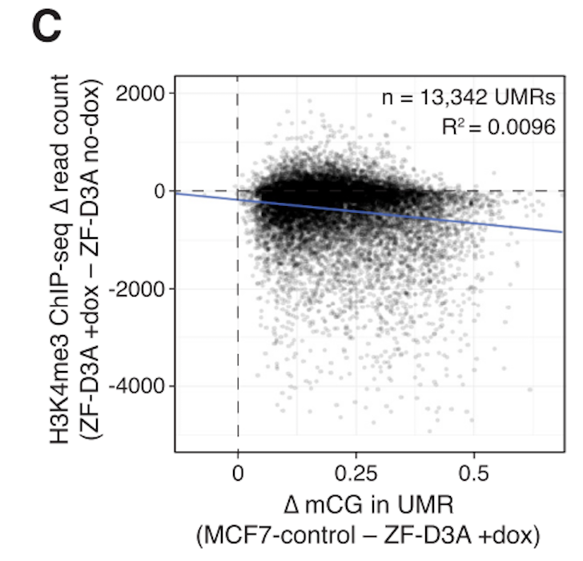
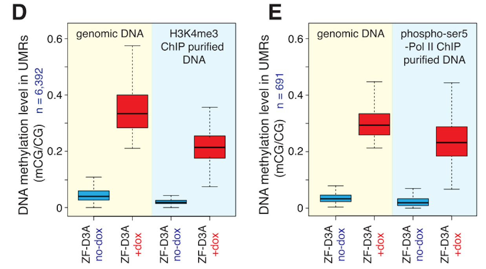

  
```{r setup, include=FALSE}
knitr::opts_chunk$set(echo = TRUE)
```
# Summary

Code to analyse the chromatin mark ChiP-BS counts from the paper by Ford et al., 
"Frequent lack of repressive capacity of promoter DNA methylation identified 
through genome-wide epigenomic manipulation" (
available on [BioRxiv](https://www.biorxiv.org/content/early/2017/09/20/170506)).

Here we want to answer the question: are active chromatin marks decreased after
forced promoter DNA methylation?

# Workspace Setup

First we load the necessary packages.

```{r, workspace, message=FALSE, warning=FALSE}
library(data.table)
library(dplyr)
library(tidyr)
library(GenomicRanges)
library(ggplot2)
library(R.utils)
library(DESeq2)
library(annotatr)
library(rtracklayer)
library(BiocParallel)
library(bsseq)
library(cowplot)
library(GEOquery)
library(SRAdb)
library(Rsamtools)
library(readr)
library(GenomicAlignments)
library(dmrseq)
library(DelayedMatrixStats)
library(Rsubread)

# data directory
datdir <- "../DATA"
fqdir <- file.path(datdir, "RAW")
tmpdir <- file.path(fqdir, "TEMP")
dir.create(datdir, showWarnings = FALSE)
dir.create(fqdir, showWarnings = FALSE)
dir.create(tmpdir, showWarnings = FALSE)

# rscript directory
rdir <- "../R/"
sourceDirectory(rdir)

# results directory
resdir <- "../RESULTS"
dir.create(resdir, showWarnings = FALSE)

# plots directory
plotdir <- "../plots"
dir.create(plotdir, showWarnings = FALSE)

# parallel backend
ncores <- 6
register(MulticoreParam(workers=ncores))

# path to where TrimGalore! tool is installed
trimgalorepath <- "~/trim_galore_zip/trim_galore"

# path to where bismark is installed
bismarkpath <- "~/bin/Bismark"

# output files
cbs.h3k4.file <- file.path(datdir, "chipBS_h3k4.rds")
cbs.polII.file <- file.path(datdir, "chipBS_polII.rds")
```

# Data download

First download the relevant Supplementary Tables (S1, S2, S3, and S4) from the BioRxiv site.

```{r, downloadSupp}
supp_file1 <- file.path(datdir, "170506-1.txt")
supp_file2 <- file.path(datdir, "170506-2.txt")
supp_file3 <- file.path(datdir, "170506-3.txt")
supp_file4 <- file.path(datdir, "170506-4.txt")
baseurl <- "https://www.biorxiv.org/highwire/filestream/57972/field_highwire_adjunct_files/"

if (!file.exists(supp_file1)){
  download.file(url = paste0(baseurl, "0/170506-1.txt"), destfile =  supp_file1)
}

if (!file.exists(supp_file2)){
  download.file(url = paste0(baseurl, "1/170506-2.txt"), destfile =  supp_file2)
}

if (!file.exists(supp_file3)){
  download.file(url = paste0(baseurl, "2/170506-3.txt"), destfile =  supp_file3)
}

if (!file.exists(supp_file4)){
  download.file(url = paste0(baseurl, "3/170506-4.txt"), destfile =  supp_file4)
}
```

Next we download the RNA-seq count table from GEO (accession number GSE102395)

```{r, downloadGEO}
# expression counts
file <- file.path(datdir, "GSE102395_MCF7_ZF_DNMT3A_countstable.txt")

if (!file.exists(file)){
  download.file(url = "ftp://ftp.ncbi.nlm.nih.gov/geo/series/GSE102nnn/GSE102395/suppl/GSE102395%5FMCF7%5FZF%5FDNMT3A%5Fcountstable%2Etxt%2Egz",
              destfile = file.path(file, ".gz"))
  gunzip(paste0(file, ".gz"))
}
```

Finally, we download the raw ChIP-BS data for H3K4Me3 and RNA Pol II  
from the same GEO accession number 
as the RNA-seq count table. 

```{r, downloadGEO2}
# metadata
meta = pData(phenoData(getGEO("GSE102395")[[1]]))
filePaths <- as.character(meta$supplementary_file_1[grepl("H3K4", meta$characteristics_ch1.2) |
                                                    grepl("polymerase", meta$characteristics_ch1.2)])
srxs <- meta[grepl("H3K4", meta$characteristics_ch1.2) |
             grepl("polymerase", meta$characteristics_ch1.2),]
dataset <- ifelse(grepl("H3K4", srxs$`antibody:ch1`), "H3K4", "PolII")
grouping <- ifelse(grepl("noDOX|noDox", srxs$source_name_ch1), "Ctrl", "Meth")
srxs <- unlist(lapply(strsplit(as.character(srxs$relation.1), "="), 
                      function(x) x[2]))

## Get DB (might take few minutes) for querying SRRs from SRXs
sqlfile <- file.path(datdir,
                    paste("SRAmetadb.sqlite.gz", sep= '.'))
if (!file.exists(gsub(".gz", "", sqlfile))){
  getSRAdbFile(sqlfile)
}
sra_con<- dbConnect(SQLite(), gsub(".gz", "", sqlfile))

# fastq-dump
all.sra <- NULL
for (srx in srxs) {
    sra <- dbGetQuery(sra_con, paste0("select experiment_accession, run_accession from sra where experiment_accession = '", srx, "'"))$run_accession
  
 if(!file.exists(file.path(fqdir, paste0(sra, ".fastq")))){
    message("fastq-dump of ", sra)
    code <- system(paste0("fastq-dump ", sra, " --outdir ", fqdir))
    stopifnot(code==0L)
  }else{
    message("fastq-dump of ", sra, " already completed.")
  }
  all.sra <- c(all.sra, sra)
}
all.fastq <- paste0(all.sra, ".fastq")

# fastqc
for (fi in all.fastq){
  if (!file.exists(file.path(fqdir, gsub(".fastq", "_fastqc.html", fi)))){
   system(paste0("fastqc ", file.path(fqdir, fi), " -o ", fqdir))
  }
}

# quality / adapter trimming 
for (fi in all.fastq){
  if (!file.exists(file.path(fqdir, gsub(".fastq", "_trimmed.fq", fi)))){
   system(paste0(trimgalorepath, " ", file.path(fqdir, fi), " -o ",
                 fqdir, " --fastqc"))
  }
}

# download assembly
assemblyfile <- file.path(fqdir, "hg19.assembly.fa")

if (!file.exists(assemblyfile)){
  if (!file.exists(paste0(assemblyfile, ".gz"))){
  download.file(url = "ftp://ftp.ensembl.org/pub/grch37/release-92/fasta/homo_sapiens/dna/Homo_sapiens.GRCh37.dna.primary_assembly.fa.gz",
                destfile = paste0(assemblyfile, ".gz"))
  }
  gunzip(filename = paste0(assemblyfile, ".gz"),
         destname = assemblyfile)
}
```

# Process ChIP-seq data

We proceed with processing the ChIP-seq data. The fastq files and reference 
assembly have been downloaded
and now the reads need to be mapped to the reference genome in order to obtain bam files.
We first generate an index reference genome, and then use Bismark to perform the
mapping in a bisulfite-conversion aware manner.

```{r, processchip}
# build index genome for bismark -- version v0.17.0
indexDir <- file.path(fqdir, "Bisulfite_Genome")
if (!file.exists(file.path(indexDir, "GA_conversion/BS_GA.rev.2.bt2"))){
  system(paste0(file.path(bismarkpath, "bismark_genome_preparation"), " --bowtie2 ", fqdir ))
}

bam.files <- file.path(fqdir, paste0(all.sra, "_trimmed_bismark_bt2.bam"))
all.fastq <- file.path(fqdir, gsub(".fastq", "_trimmed.fq", 
                                   paste0(all.sra, ".fastq")))
for (b in seq_along(bam.files)){
  tmpfiles <- list.files(path = tmpdir, pattern = paste0(basename(bam.files[b]), ".temp"), 
                         full.names = TRUE)
  tmpfiles <- c(tmpfiles, list.files(path = tmpdir, 
                                     pattern = paste0(basename(all.fastq[b]), ".temp"),
                                     full.names = TRUE))
  if (!file.exists(bam.files[b]) || length(tmpfiles) > 0){
    # cleanup
    if (length(tmpfiles) > 0){
      file.remove(tmpfiles)
    }
    
    if (file.exists(bam.files[b])){
      file.remove(bam.files[b])
    }
    
    # run bismark
    system(paste0(file.path(bismarkpath, "bismark"), " --bowtie2 --multicore ",
                  ncores, " --fastq ",
                  "--bam -o ", fqdir, " --temp_dir ", tmpdir, " ", 
                  fqdir, " ", all.fastq[b]))
  }
}

# sort bamfiles
bam.files <- file.path(fqdir, paste0(all.sra, "_trimmed_bismark_bt2.bam"))
bam.files.sort <- file.path(fqdir, paste0(dataset,"_", grouping, 
                                          "_trimmed_bismark_bt2_sorted.bam"))
for (bf in seq_along(bam.files)){
  if (!file.exists(bam.files.sort[bf])){
    message("Sorting bam file: ", bam.files[bf])
    system(paste0("samtools sort ", bam.files[bf], " -@ ", ncores, " -o ", 
                  bam.files.sort[bf]))
  }else{
    message("Bam file ", bf, " already sorted.")
  }
}

# Extract the methylation estimates
covfiles <- gsub(".bam", ".bismark.cov.gz", bam.files.sort)
  file.path(fqdir, paste0(srxs, ".CpG_report.txt"))
for (b in seq_along(bam.files.sort)){
  if (length(list.files(path = fqdir,
                        pattern = paste0("CpG_context_", basename(covfiles[b]),
                                         ".*methXtractor.temp"))) > 0){
    file.remove(list.files(path = fqdir,
                        pattern = paste0("CpG_context_", basename(covfiles[b]),
                                         ".*methXtractor.temp"),
                        full.names = TRUE))
    file.remove(covfiles[b])
  }
  
  if (!file.exists(covfiles[b])){
    system(paste0(file.path(bismarkpath, "bismark_methylation_extractor"),
                  " -s --comprehensive --merge_non_CpG -o ",
                  fqdir, " --multicore ", ncores, " --buffer_size 20G --counts ",
                  "--bedGraph --gzip --genome_folder ", fqdir,
                  " ", bam.files.sort[b]))
  }
}

# Save methylation estimates as bsseq rds object
if (!file.exists(cbs.h3k4.file)){	
  wc <- which(grepl("H3K4", covfiles))
  
	bs <- read.bismark(covfiles[wc],
				 sampleNames = paste0(dataset[wc], "_", grouping[wc]), 
				 fileType="cov",
				 strandCollapse=FALSE,
				 rmZeroCov=FALSE,
				 verbose = TRUE)
	saveRDS(bs, file=cbs.h3k4.file)
	rm(bs)
}

if (!file.exists(cbs.polII.file)){	
  wc <- which(grepl("Pol", covfiles))
  
	bs <- read.bismark(covfiles[wc],
				 sampleNames = paste0(dataset[wc], "_", grouping[wc]), 
				 fileType="cov",
				 strandCollapse=FALSE,
				 rmZeroCov=FALSE,
				 verbose = TRUE)
	saveRDS(bs, file=cbs.polII.file)
	rm(bs)
}
```

Next, we'll perform peak calling using MACS2.

```{r, macs}
bedfiles <- file.path(datdir, paste0(dataset,"_", grouping, "_peaks.xls"))

for(bf in seq_along(bedfiles)){
  if (!file.exists(bedfiles[bf])){
    system(paste0("macs2 callpeak -t ", 
                  bam.files.sort[bf], 
                  " -g 2.7e9 --outdir ", datdir, " -n ", 
                  basename(gsub("_peaks.xls", "", bedfiles[bf]))))
  }
}

```

# Read in supplementary data tables

Now we'll read in the Supplementary data tables. Table S1 contains the off-target 
binding sites of ZF-D3A. Table S2 contains information 
about the DMRs. Table S3 contains information about the UMRs (unmethylated regions).
Table S4 also contains associations between UMRs and DE genes (there is no analogous
table for DMRs, so we'll have to construct one ourselves).

Note that the column names for Tables S2 and S3 are missing one, so we'll have to 
read these in with `header=FALSE` and manually add them. Here we infer that the missing
column name is for column 12 (contains 'geneBody' or 'non-geneBody'), and we name
it "genebody_classification".

Additionally, we need to
manually skip the first 1-2 lines of tables S3 and S4 since they contain multiple lines starting with
`#` that don't contain data.

Also note that for Table S3, missing data is denoted as a character string `noData`,
so we convert these values to `NA`. 

In addition, for Table S4 there is a cell with numeric values that contains a `$` 
in it. This is presumed to be a mistake, since this is not present in earlier
submitted versions of the table on BioRxiv. We remove this row from analysis.

```{r, readSupp}
ts1 <- fread(file.path(datdir, "170506-1.txt"), header=FALSE, skip=1)  #ZF Binding sites
colnames(ts1) <- c("chr", "start", "end", "closest_gene_promoter", 
                   "distance_to_nearest_promoter", "promoter_classification",
                   "CpGisland_classification", "genebody_classification",
                   "enhancer_classification")


ts2 <- fread(file.path(datdir, "170506-2.txt"), header=FALSE)  #DMRs
colnames(ts2) <- c("chr", "start", "end", "number_of_CpG_cytosines_in_region",
                   "methylation_level_in_MCF7_control", "methylation_level_in_ZF_D3A_plus_dox",
                   "methylation_level_in_ZF_D3A_dox_wd", "closest_gene_promoter",
                   "distance_to_nearest_promoter", "promoter_classification",
                   "CpGisland_classification", "genebody_classification",
                   "enhancer_classification")

ts3 <- fread(file.path(datdir, "170506-3.txt"), header=FALSE, skip=1)  #UMRs
colnames(ts3) <- colnames(ts2)
ts3 <- ts3 %>%
  mutate(methylation_level_in_ZF_D3A_dox_wd = 
           as.numeric(ifelse(methylation_level_in_ZF_D3A_dox_wd == "noData", NA, 
                  methylation_level_in_ZF_D3A_dox_wd)))

ts4 <- fread(file.path(datdir, "170506-4.txt"), header=TRUE, skip=1)  #UMRs II
colnames(ts4) <- gsub("#", "", colnames(ts4))
ts4 <- ts4 %>%
  mutate(`FoldChange_RNAseq(MCF7_control/ZF_D3A_plusDox)` =
           as.numeric(`FoldChange_RNAseq(MCF7_control/ZF_D3A_plusDox)`)) %>%
  na.omit()
```

# Normalize ChIP-BS peaks

Before comparing read counts in ChIP-seq data, we need to normalize the samples
for read depth. 

## H3K4me3

In Ford et al. (2017), the normalization of H3K4me3 ChIP-BS data is described
as follows: 

> H3K4me3 ChIP-seq data sets for ZF-D3A +dox and ZF-D3A no-dox cells were normalized by
identifying common peaks between the two samples. Peak intervals with an average mC level
of <0.2 were sub-selected and the number of reads mapped to ±50 bp of the peak center was            
used as the normalization factor. Normalized mapped reads counts in H3K4me3 read ZF-D3A           
no-dox and ZF-D3A +dox cells was measured across an interval ±2.5 kb of the center of DMRs.
The resulting intervals with more than 2,000 reads summed from both samples (n=2,735) were   
used to compare H3K4me3 occupancy between ZF-D3A no-dox and ZF-D3A+dox cells.

First we need to normalize the H3K4 data by examining total read counts in common peaks
that correspond to regions with methylation difference < 0.2 between conditions. 
We'll use the intersection of common peaks (instead of just the center +/- 50 bps
of the common peaks as done by the authors). We'll annotate them with
the average methylation level in treatment and control, and select those where both
treatment and control are less than 0.2 (using only sites with sufficient coverage 
for the avg methylation calculation). We'll also exclude regions within 5kb of
a ZF binding site. Then we'll count up the number of reads in each
of the remaining peaks. For downstream analyses, read counts are scaled by the size
factor from this total. 

```{r, normalizeH3K4}
# read in called peaks from macs
bedfiles <- file.path(datdir, paste0(dataset,"_", grouping, "_peaks.xls"))
peaks.all <- NULL
for (bf in bedfiles[grepl("H3K4", bedfiles)]){
  # import peak bed files as GRanges
  peaks <- read_tsv(bf, comment = "#", skip = 1, guess_max = 5e5) %>%
                                mutate(condition = basename(bf))
  if (length(peaks.all) > 0){
    peaks.all <- GRangesList(peaks.all, makeGRangesFromDataFrame(peaks))
  }else{
    peaks.all <- makeGRangesFromDataFrame(peaks)
  }
}

# find common peaks and use intersection boundaries
ol <- findOverlaps(peaks.all[[1]], peaks.all[[2]])
peaks.all <- GRangesList(peaks.all[[1]][ol@from], 
                         peaks.all[[2]][ol@to])
peaks.common <- peaks.all[[1]]
start(peaks.common) <- pmin(start(peaks.all[[1]]), start(peaks.all[[2]]))
end(peaks.common) <- pmax(end(peaks.all[[1]]), end(peaks.all[[2]]))

# subset on common peaks at least 5kb away from ZF binding site
seqlevels(peaks.common) <- paste0("chr", seqlevels(peaks.common))
seqlevels(peaks.common) <- gsub("chrGL", "GL", seqlevels(peaks.common))
ol <- findOverlaps(peaks.common, 
                   resize(makeGRangesFromDataFrame(ts1), 
                         width = 5000 + width(makeGRangesFromDataFrame(ts1)), 
                         fix = "center"))
peaks.common <- peaks.common[-unique(ol@from),]

# subset on common peaks with low methylation (< 0.2 in ctrl and dox)
#load bsseq data (processed in MethylationCountsAnalysis.Rmd)
bs <- readRDS(file.path(datdir, "bsseq.rds"))
bs <- bs[,pData(bs)$dox != "Dox Withdrawal" | pData(bs)$condition == "Control"]

cov.mat <- getCoverage(bs, type="Cov")
filter <- pmax( 1*(DelayedMatrixStats::rowSums2(cov.mat[,pData(bs)$condition == "Control"]) < 5),
                1*(DelayedMatrixStats::rowSums2(cov.mat[,pData(bs)$condition == "Methylated"]) < 5))
filter <- which(filter > 0)
bs <- bs[-filter,]
rm(cov.mat)

ol <- as.data.frame(findOverlaps(peaks.common, bs)) %>%
      group_by(queryHits) %>% 
      summarize(s = min(subjectHits),
                e = max(subjectHits))
indexRanges <- IRanges(ol$s, ol$e)
prop.mat <- getCoverage(bs, type = "M")/getCoverage(bs, type = "Cov")
prop.mat <- extractROWS(prop.mat, indexRanges)

mean.ctrl <- DelayedMatrixStats::rowMeans2(prop.mat[,
            pData(bs)$condition=="Control"], na.rm = TRUE)
mean.meth <- DelayedMatrixStats::rowMeans2(prop.mat[,
            pData(bs)$condition=="Methylated"], na.rm = TRUE)
mean.ctrl <- IRanges::mean(IRanges::relist(mean.ctrl, indexRanges), na.rm = TRUE)
mean.meth <- IRanges::mean(IRanges::relist(mean.meth, indexRanges), na.rm = TRUE)
peaks.common <- peaks.common[ol$queryHits,] # subset on those that overlap methylation sites
peaks.common <- peaks.common[which(mean.ctrl < 0.2 & mean.meth < 0.2), ]

# Count up reads in bamfiles landing in common peaks
# create a BamFileList object
bamfiles <- list.files(fqdir, pattern="*.bam", full.names = TRUE)
bamfiles <- bamfiles[file.info(bamfiles)$size > 0 & grepl("H3K4", bamfiles) &
                     !grepl("indel", bamfiles)]
bfL.H3K4 <- BamFileList(bamfiles, index = character())

# summarizeOverlaps with "union"
seqlevels(peaks.common) <- gsub("chr", "", seqlevels(peaks.common))
rse <- summarizeOverlaps(peaks.common, bfL.H3K4, mode = "Union")

totalReads <- colSums(assays(rse)$counts)
sizeFactors.H3K4 <- totalReads/median(totalReads)
sizeFactors.H3K4
```

## RNA pol II

In the manuscript, the normalization of RNA pol II ChIP-BS is not discussed. We
will process it in the same manner as the H3k4me3 data in the previous section.
Note that there are much fewer peaks in this data, so we'll use the intersection
of common peaks (not restricting to the center +/- 50bps as done by the authors).

```{r, normalizePolII}
# read in called peaks from macs
bedfiles <- file.path(datdir, paste0(dataset,"_", grouping, "_peaks.xls")) 
peaks.all <- NULL
for (bf in bedfiles[grepl("PolII", bedfiles)]){
  # import peak bed files as GRanges
  peaks <- read_tsv(bf, comment = "#", skip = 1, guess_max = 5e5) %>%
                                mutate(condition = basename(bf))
  if (length(peaks.all) > 0){
    peaks.all <- GRangesList(peaks.all, makeGRangesFromDataFrame(peaks))
  }else{
    peaks.all <- makeGRangesFromDataFrame(peaks)
  }
}

# find common peaks and use intersection boundaries
ol <- findOverlaps(peaks.all[[1]], peaks.all[[2]])
peaks.all <- GRangesList(peaks.all[[1]][ol@from], 
                         peaks.all[[2]][ol@to])
peaks.common <- peaks.all[[1]]
start(peaks.common) <- pmin(start(peaks.all[[1]]), start(peaks.all[[2]]))
end(peaks.common) <- pmax(end(peaks.all[[1]]), end(peaks.all[[2]]))

# subset on common peaks at least 5kb away from ZF binding site
seqlevels(peaks.common) <- paste0("chr", seqlevels(peaks.common))
seqlevels(peaks.common) <- gsub("chrGL", "GL", seqlevels(peaks.common))
ol <- findOverlaps(peaks.common, 
                   resize(makeGRangesFromDataFrame(ts1), 
                         width = 5000 + width(makeGRangesFromDataFrame(ts1)), 
                         fix = "center"))
peaks.common <- peaks.common[-unique(ol@from),]

# subset on common peaks with low methylation (< 0.2 in ctrl and dox)
ol <- as.data.frame(findOverlaps(peaks.common, bs)) %>%
      group_by(queryHits) %>% 
      summarize(s = min(subjectHits),
                e = max(subjectHits))
indexRanges <- IRanges(ol$s, ol$e)
prop.mat <- getCoverage(bs, type = "M")/getCoverage(bs, type = "Cov")
prop.mat <- extractROWS(prop.mat, indexRanges)

mean.ctrl <- DelayedMatrixStats::rowMeans2(prop.mat[,
            pData(bs)$condition=="Control"], na.rm = TRUE)
mean.meth <- DelayedMatrixStats::rowMeans2(prop.mat[,
            pData(bs)$condition=="Methylated"], na.rm = TRUE)
mean.ctrl <- IRanges::mean(IRanges::relist(mean.ctrl, indexRanges), na.rm = TRUE)
mean.meth <- IRanges::mean(IRanges::relist(mean.meth, indexRanges), na.rm = TRUE)
peaks.common <- peaks.common[ol$queryHits,] # subset on those that overlap methylation sites
peaks.common <- peaks.common[which(mean.ctrl < 0.2 & mean.meth < 0.2), ]

# Count up reads in bamfiles landing in common peaks
# create a BamFileList object
bamfiles <- list.files(fqdir, pattern="*.bam", full.names = TRUE)
bamfiles <- bamfiles[file.info(bamfiles)$size > 0 & grepl("PolII", bamfiles) &
                     !grepl("indel", bamfiles)]
bfL.PolII <- BamFileList(bamfiles, index = character())

# summarizeOverlaps with "union"
seqlevels(peaks.common) <- gsub("chr", "", seqlevels(peaks.common))
rse <- summarizeOverlaps(peaks.common, bfL.PolII, mode = "Union")

totalReads <- colSums(assays(rse)$counts)
sizeFactors.PolII <- totalReads/median(totalReads)
sizeFactors.PolII
```

# Associate methylation with ChIP-BS counts

With the tables in hand, we will make a scatterplot similar to
Figure 3 from the Ford et al. (2017).
Below is a screenshot of what this figure looks like. 



Note that the x-axis in Figure 3C is mislabeled. The change in $\Delta$mCG is computed
as +Dox - control (since the dox induces methylation, and most values are positive).
Figure 3 is used make some of the main claims of the paper. 
For example, the manuscript states that

> These data demonstrate that forced DNA methylation is not sufficient to disrupt H3K4me3 occupancy or the interaction of initiated RNA polymerase II with genomic DNA.

In more detail, this statement is backed up by the following detail regarding Figure 3C

> Notably, there is no correlation between the change in DNA methylation and the level of H3K4me3 in UMRs (Fig. 3C).

> In DNA purified by H3K4me3 ChIP in ZF-D3A +dox, 21% of CpGs within the 6,392 H3K4me3 peaks were methylated, demonstrating that H3K4me3 and DNA methylation can exist simultaneously at the same site upon forced induction of DNA methylation (Fig. 3D). 

> Importantly, phospho-Ser5 RNA pol II was clearly able to directly interact with ZF-D3A methylated DNA (Fig. 3E)

In the following series of plots we'll evaluate the evidence for these conclusions.

## Scatterplot of methylation and H3K4me3 counts

We first start with a scatterplot of methylation difference and
difference in H3K4me3. 

First, we need to find overlaps between the dmrseq DMRs and H3K4me3 reads.
The DMRs were prepared in the `methylationCountAnalysis.Rmd` analysis.

```{r, intersectchip-dmrs}
dmrs <- (dmrs <- readRDS(file.path(resdir, "regions.rds")))[dmrs$qval < 0.10, ]

bs <- (bs<- readRDS(file.path(datdir, "bsseq.rds")))[,pData(bs)$condition == "Control" | 
          pData(bs)$dox == "DOX"]
cov.mat <- getCoverage(bs, type="Cov")
filter <- pmax( 1*(rowSums2(cov.mat[,pData(bs)$condition == "Control"]) == 0),
                1*(rowSums2(cov.mat[,pData(bs)$condition == "Methylated"]) == 0))
filter <- which(filter > 0)
bs <- bs[-filter,]
rm(cov.mat)
dmrs$meanDiff <- meanDiff(bs, dmrs=dmrs, testCovariate="condition")
seqlevels(dmrs) <- gsub("chr", "", seqlevels(dmrs))

# uniform sizes of dmrs
dmrs <- resize(dmrs, width = 5000, fix = "center")
rse <- summarizeOverlaps(dmrs, bfL.H3K4, mode = "Union")
assays(rse)$normcounts <- t(apply(assays(rse)$counts, 1,
                                function(x) x / sizeFactors.H3K4))

annot_islands = build_annotations(genome = 'hg19', 
                                  annotations = 'hg19_cpg_islands')
seqlevels(annot_islands) <- gsub("chr", "", seqlevels(annot_islands))
dmrs$CGI <- countOverlaps(dmrs, annot_islands, minoverlap = 100) > 0

# add counts to dmr dataframe
dmrs.chip <- data.frame(dmrs) %>%
  mutate(chip.dox.norm = assays(rse)$normcounts[,grepl("Meth", colnames(rse))],
         chip.ctrl.norm = assays(rse)$normcounts[,grepl("Ctrl", colnames(rse))],
         chip.dox = assays(rse)$counts[,grepl("Meth", colnames(rse))],
         chip.ctrl = assays(rse)$counts[,grepl("Ctrl", colnames(rse))],
         FC = chip.dox / chip.ctrl,
         FC.norm = chip.dox.norm / chip.ctrl.norm,
         bin = cut(meanDiff, c(0,0.2,0.3,0.4,0.5,0.6,1)),
         binS = cut(stat, c(0,8,9,10,12,15,20,25,46))) %>%
  filter(chip.dox.norm + chip.ctrl.norm > 50)
```

Next, we construct the scatter plot of methylation change in DMRs versus normalized
difference in H3K4me3 ChIP-Seq normalized read counts. 

```{r, fig3c-dmrs}
# normalized
f2a <- ggplot(dmrs.chip %>% filter(meanDiff > 0), 
       aes(y = FC.norm, x = meanDiff)) +
  geom_point(size=0.5, alpha=0.75) + 
  geom_hline(yintercept=1, col="black") +
  geom_hline(yintercept=1, col="white", linetype="dashed") +
  scale_y_continuous(trans="log2") +
  theme_bw() +
  xlab(expression(paste(Delta, "mCG in dmrseq DMR (dox - no dox)"))) +
  ylab("H3K4me3 readcount Fold Change (dox/no dox)") +
  ggtitle("Normalized ChIP-BS read counts") +
  geom_smooth()
f2a
ggsave(file.path(plotdir, "mCG_vs_H3K4me3_scatter_DMR.pdf"))
saveRDS(f2a, file.path(plotdir, "mCG_vs_H3K4me3_scatter_DMR.rds"))

# boxplot version
n_fun <- function(x){
  return(data.frame(y = log2(0.08), 
                    label = paste0("(n = ", scales::comma(length(x)), ")")))
}
ggplot(dmrs.chip %>% filter(meanDiff > 0), 
       aes(y = FC.norm, x = bin)) +
  geom_hline(yintercept=1, col="black") +
  geom_hline(yintercept=1, col="white", linetype="dashed") +
  geom_boxplot() +
  stat_summary(fun.data = n_fun, geom = "text") +
  scale_y_continuous(trans="log2") +
  theme_bw() +
  xlab(expression(paste(Delta, "mCG bin in DMR (dox - no dox)"))) +
  ylab("H3K4me3 readcount Fold Change (dox/no dox)")  +
  geom_point(data = dmrs.chip %>% filter(bin == "(0.6,1]"), position="jitter",
             color = "grey")
ggsave(file.path(plotdir, "mCG_vs_H3K4me3_bins_DMR.pdf"))
```

Now we'll make a similar plot, but with the DMR significance on the x-axis instead
of methylation difference effect size.

```{r, fig3c-dmrs-stat}
# normalized
f2b <- ggplot(dmrs.chip %>% filter(meanDiff > 0), 
       aes(y = FC.norm, x = stat)) +
  geom_point(size=0.5, alpha=0.75, aes(color = qval < 0.01)) + 
  geom_hline(yintercept=1, col="black") +
  geom_hline(yintercept=1, col="white", linetype="dashed") +
  scale_colour_manual(values = c("grey", "black")) + 
  scale_y_continuous(trans="log2") +
  theme_bw() +
  xlab("dmrseq statistic") +  
  ylab("H3K4me3 readcount Fold Change (dox/no dox)") +
  ggtitle("Normalized ChIP-BS read counts") +
  geom_smooth() + 
  theme(legend.position = "none")
f2b
ggsave(file.path(plotdir, "stat_vs_H3K4me3_scatter_DMR.pdf"))
saveRDS(f2b, file.path(plotdir, "stat_vs_H3K4me3_scatter_DMR.rds"))

# CGI only
f2b <- ggplot(dmrs.chip %>% filter(meanDiff > 0) %>% filter(CGI), 
       aes(y = FC.norm, x = stat)) +
  geom_point(size=0.5, alpha=0.75, aes(color = qval < 0.01)) + 
  geom_hline(yintercept=1, col="black") +
  geom_hline(yintercept=1, col="white", linetype="dashed") +
  scale_colour_manual(values = c("grey", "black")) + 
  scale_y_continuous(trans="log2") +
  theme_bw() +
  xlab("dmrseq statistic") +  
  ylab("H3K4me3 readcount Fold Change (dox/no dox)") +
  ggtitle("Normalized ChIP-BS read counts") +
  geom_smooth() + 
  theme(legend.position = "none")
f2b
saveRDS(f2b, file.path(plotdir, "stat_vs_H3K4me3_scatter_DMR_CGI.rds"))

# CGI only
f2b <- ggplot(dmrs.chip %>% filter(meanDiff > 0) %>% filter(!CGI), 
       aes(y = FC.norm, x = stat)) +
  geom_point(size=0.5, alpha=0.75, aes(color = qval < 0.01)) + 
  geom_hline(yintercept=1, col="black") +
  geom_hline(yintercept=1, col="white", linetype="dashed") +
  scale_colour_manual(values = c("grey", "black")) + 
  scale_y_continuous(trans="log2") +
  theme_bw() +
  xlab("dmrseq statistic") +  
  ylab("H3K4me3 readcount Fold Change (dox/no dox)") +
  ggtitle("Normalized ChIP-BS read counts") +
  geom_smooth() + 
  theme(legend.position = "none")
f2b
saveRDS(f2b, file.path(plotdir, "stat_vs_H3K4me3_scatter_DMR_nonCGI.rds"))

# boxplot version
n_fun <- function(x){
  return(data.frame(y = log2(0.08), 
                    label = paste0("(n = ", scales::comma(length(x)), ")")))
}
ggplot(dmrs.chip %>% filter(meanDiff > 0), 
       aes(y = FC.norm, x = binS)) +
  geom_hline(yintercept=1, col="black") +
  geom_hline(yintercept=1, col="white", linetype="dashed") +
  geom_boxplot() +
  stat_summary(fun.data = n_fun, geom = "text") +
  scale_y_continuous(trans="log2") +
  theme_bw() +
  xlab("dmrseq statistic bin (dox - no dox)") +
  ylab("H3K4me3 readcount Fold Change (dox/no dox)")  
ggsave(file.path(plotdir, "stat_vs_H3K4me3_bins_DMR.pdf"))
```

Finally, we'll calculate the odds of association with H3K4me3 occupancy
in the expected direction.

```{r}
dmrs.chip <- dmrs.chip %>% filter(qval < 0.01)
up <- sum(dmrs.chip$FC.norm > 1)
dn <- sum(dmrs.chip$FC.norm < 1)

n <- dn + up
prop <- dn / n
odds <- dn / up

prop
odds

prop.ci <- prop + c(-1,1)*qnorm(0.975)*sqrt(prop*(1-prop)/n)
odds.ci <- prop.ci*n / ((1-prop.ci)*n)

prop.ci
odds.ci
```

## Scatterplot of methylation and RNA PolII counts

First, we need to find overlaps between the dmrseq DMRs and DNA PolII reads.
The DMRs were prepared in the `methylationCountAnalysis.Rmd` analysis.

```{r, intersectchip-dmrs-pol2}
dmrs <- (dmrs <- readRDS(file.path(resdir, "regions.rds")))[dmrs$qval < 0.10, ]

bs <- (bs<- readRDS(file.path(datdir, "bsseq.rds")))[,pData(bs)$condition == "Control" | 
          pData(bs)$dox == "DOX"]
cov.mat <- getCoverage(bs, type="Cov")
filter <- pmax( 1*(rowSums2(cov.mat[,pData(bs)$condition == "Control"]) == 0),
                1*(rowSums2(cov.mat[,pData(bs)$condition == "Methylated"]) == 0))
filter <- which(filter > 0)
bs <- bs[-filter,]
rm(cov.mat)
dmrs$meanDiff <- meanDiff(bs, dmrs=dmrs, testCovariate="condition")
seqlevels(dmrs) <- gsub("chr", "", seqlevels(dmrs))

# uniform sizes of dmrs
dmrs <- resize(dmrs, width = 5000, fix = "center")
rse <- summarizeOverlaps(dmrs, bfL.PolII, mode = "Union")
assays(rse)$normcounts <- t(apply(assays(rse)$counts, 1,
                                function(x) x / sizeFactors.PolII))

dmrs$CGI <- countOverlaps(dmrs, annot_islands, minoverlap = 100) > 0

# add counts to dmr dataframe
dmrs.chip <- data.frame(dmrs) %>%
  mutate(chip.dox.norm = assays(rse)$normcounts[,grepl("Meth", colnames(rse))],
         chip.ctrl.norm = assays(rse)$normcounts[,grepl("Ctrl", colnames(rse))],
         chip.dox = assays(rse)$counts[,grepl("Meth", colnames(rse))],
         chip.ctrl = assays(rse)$counts[,grepl("Ctrl", colnames(rse))],
         FC = chip.dox / chip.ctrl,
         FC.norm = chip.dox.norm / chip.ctrl.norm,
         bin = cut(meanDiff, c(0,0.2,0.3,0.4,0.5,0.6,1)),
         binS = cut(stat, c(0,8,9,10,12,15,20,25,46))) %>%
  filter(chip.dox.norm + chip.ctrl.norm > 50)
```

Next, we construct the scatter plot of methylation change in DMRs versus normalized
difference in RNA PolII ChIP-Seq normalized read counts. 

```{r, fig3c-dmrs-pol2}
# normalized
f2c <- ggplot(dmrs.chip %>% filter(meanDiff > 0), 
       aes(y = FC.norm, x = meanDiff)) +
  geom_point(size=0.5, alpha=0.75) + 
  geom_hline(yintercept=1, col="black") +
  geom_hline(yintercept=1, col="white", linetype="dashed") +
  scale_y_continuous(trans = "log2") +
  theme_bw() +
  xlab(expression(paste(Delta, "mCG in dmrseq DMR (dox - no dox)"))) +
  ylab(expression(paste(Delta, "log2 FC RNA PolII readcount (dox/no dox)"))) +
  ggtitle("Normalized ChIP-BS read counts") +
  xlim(0.07,0.75) +
  geom_smooth()
f2c 
ggsave(file.path(plotdir, "mCG_vs_RNApolII_scatter_DMR.pdf"))
saveRDS(f2c, file.path(plotdir, "mCG_vs_RNApolII_scatter_DMR.rds"))

# boxplot version
n_fun <- function(x){
  return(data.frame(y = log2(0.08), 
                    label = paste0("(n = ", scales::comma(length(x)), ")")))
}
ggplot(dmrs.chip %>% filter(meanDiff > 0), 
       aes(y = FC.norm, x = bin)) +
  geom_hline(yintercept=1, col="black") +
  geom_hline(yintercept=1, col="white", linetype="dashed") +
  geom_boxplot() +
  stat_summary(fun.data = n_fun, geom = "text") +
  scale_y_continuous(trans="log2") +
  theme_bw() +
  xlab(expression(paste(Delta, "mCG bin in DMR (dox - no dox)"))) +
  ylab("RNA PolII readcount Fold Change (dox/no dox)")  +
  geom_point(data = dmrs.chip %>% filter(bin == "(0.6,1]"), position="jitter",
             color = "grey")
ggsave(file.path(plotdir, "mCG_vs_RNApolII_bins_DMR.pdf"))
```

Now we'll make a similar plot, but with the DMR significance on the x-axis instead
of methylation difference effect size.

```{r, fig3c-dmrs-stat-pol2}
# normalized
f2d <- ggplot(dmrs.chip %>% filter(meanDiff > 0), 
       aes(y = FC.norm, x = stat)) +
  geom_point(size=0.5, alpha=0.75, aes(color = qval < 0.01)) + 
  geom_hline(yintercept=1, col="black") +
  geom_hline(yintercept=1, col="white", linetype="dashed") +
  scale_y_continuous(trans = "log2") +
  scale_colour_manual(values = c("grey", "black")) + 
  theme_bw() +
  xlab("dmrseq statistic") +
  ylab(expression(paste(Delta, "log2 FC RNA PolII readcount (dox/no dox)"))) +
  ggtitle("Normalized ChIP-BS read counts") +
  geom_smooth() + 
  theme(legend.position = "none")
f2d
ggsave(file.path(plotdir, "stat_vs_RNApolII_scatter_DMR.pdf"))
saveRDS(f2d, file.path(plotdir, "stat_vs_RNApolII_scatter_DMR.rds"))

# CGI only
f2d <- ggplot(dmrs.chip %>% filter(meanDiff > 0) %>% filter(CGI), 
       aes(y = FC.norm, x = stat)) +
  geom_point(size=0.5, alpha=0.75, aes(color = qval < 0.01)) + 
  geom_hline(yintercept=1, col="black") +
  geom_hline(yintercept=1, col="white", linetype="dashed") +
  scale_y_continuous(trans = "log2") +
  scale_colour_manual(values = c("grey", "black")) + 
  theme_bw() +
  xlab("dmrseq statistic") +
  ylab(expression(paste(Delta, "log2 FC RNA PolII readcount (dox/no dox)"))) +
  ggtitle("Normalized ChIP-BS read counts") +
  geom_smooth() + 
  theme(legend.position = "none")
f2d
saveRDS(f2d, file.path(plotdir, "stat_vs_RNApolII_scatter_DMR_CGI.rds"))

# CGI only
f2d <- ggplot(dmrs.chip %>% filter(meanDiff > 0) %>% filter(!CGI), 
       aes(y = FC.norm, x = stat)) +
  geom_point(size=0.5, alpha=0.75, aes(color = qval < 0.01)) + 
  geom_hline(yintercept=1, col="black") +
  geom_hline(yintercept=1, col="white", linetype="dashed") +
  scale_y_continuous(trans = "log2") +
  scale_colour_manual(values = c("grey", "black")) + 
  theme_bw() +
  xlab("dmrseq statistic") +
  ylab(expression(paste(Delta, "log2 FC RNA PolII readcount (dox/no dox)"))) +
  ggtitle("Normalized ChIP-BS read counts") +
  geom_smooth() + 
  theme(legend.position = "none")
f2d
saveRDS(f2d, file.path(plotdir, "stat_vs_RNApolII_scatter_DMR_nonCGI.rds"))

# boxplot version
n_fun <- function(x){
  return(data.frame(y = log2(0.08), 
                    label = paste0("(n = ", scales::comma(length(x)), ")")))
}
ggplot(dmrs.chip %>% filter(meanDiff > 0), 
       aes(y = FC.norm, x = binS)) +
  geom_hline(yintercept=1, col="black") +
  geom_hline(yintercept=1, col="white", linetype="dashed") +
  geom_boxplot() +
  stat_summary(fun.data = n_fun, geom = "text") +
  scale_y_continuous(trans="log2") +
  theme_bw() +
  xlab("dmrseq statistic bin (dox - no dox)") +
  ylab("RNA PolII readcount Fold Change (dox/no dox)")  
ggsave(file.path(plotdir, "stat_vs_RNApolII_bins_DMR.pdf"))
```

Finally, we'll calculate the odds of association with RNA pol II occupancy
in the expected direction.

```{r}
dmrs.chip <- dmrs.chip %>% filter(qval < 0.01)
up <- sum(dmrs.chip$FC.norm > 1)
dn <- sum(dmrs.chip$FC.norm < 1)

n <- dn + up
prop <- dn / n
odds <- dn / up

prop
odds

prop.ci <- prop + c(-1,1)*qnorm(0.975)*sqrt(prop*(1-prop)/n)
odds.ci <- prop.ci*n / ((1-prop.ci)*n)

prop.ci
odds.ci
```

# Methylation of ChIP-bound DNA

Next will perform an analysis similar to Figure 5D-E, the boxplots of methylation level in UMRs in DNA versus 
in H3K4me3 / DNA Polymerase II ChIP-ed DNA.



In more detail, Figure 3D and E are used to support the following claims:

> In DNA purified by H3K4me3 ChIP in ZF-D3A +dox, 21% of CpGs within the 6,392 H3K4me3 peaks were methylated, demonstrating that H3K4me3 and DNA methylation can exist simultaneously at the same site upon forced induction of DNA methylation (Fig. 3D). 

> Importantly, phospho-Ser5 RNA pol II was clearly able to directly interact with ZF-D3A methylated DNA (Fig. 3E)

To construct these figures, we need to intersect the ChIP-BS data with the DMRs. 
we'll use both the whole genome bisulfite sequencing data and the ChIP-BS
data. See the 
`methylationCountAnalysis.Rmd` for details on how the WGBS data is downloaded and 
processed.

In the paper, the authors used merged peaks between control and dox (using peak 
intersections) that also intersect with a UMR with >0.2 methylation 
change. Since the vast majority of methylation differences from control to dox
are in the positive direction, it is not surprising that the boxplots show a 
methylation difference in the positive direction. What we'd really like to contrast 
is the methylation level in DMRs that overlap a peak with DMRs that do not overlap 
a peak. We expect that if H3K4Me3 sites are usually demethylated, and if forced 
methylation really does influence H3K4Me3 levels, the methylation level in 
UMRs that don't overlap H3K4Me3 peaks will be higher on average than those which
do overlap a peak. And the same thing goes for RNA Pol II peaks.

## Read in ChIP-BS data

Here we read in the ChIP-BS data, which according to GEO has the following format:
>> For the ChIP-BS-seq data the 'allC' file format is a tab-delimited text file with the following columns: 1) chromosome, 2) position, 3) position, 4) strand, 5) context, 6) cytosine base calls, and 7) all base calls.

```{r, read.lister}
bs.h3k4 <- readRDS(file=cbs.h3k4.file)
bs.pol <- readRDS(file=cbs.polII.file)
seqlevels(bs.h3k4) <- paste0("chr", seqlevels(bs.h3k4))
seqlevels(bs.pol) <- paste0("chr", seqlevels(bs.pol))

bs <- readRDS(file.path(datdir, "bsseq.rds"))
bs <- bs[,pData(bs)$dox != "Dox Withdrawal" | pData(bs)$condition == "Control"]

sampleNames(bs.h3k4) <- ifelse(grepl("Ctrl", sampleNames(bs.h3k4)), 
                               "noDOX", "DOX")
sampleNames(bs.pol) <- ifelse(grepl("Ctrl", sampleNames(bs.pol)), 
                               "noDOX", "DOX")
sampleNames(bs) <- pData(bs)$basefile

show(bs.h3k4)
show(bs.pol)
```

## H3K4me3

First we'll make the plot comparing average methylation values in DMRs by whether
they overlap a H3K4me3 peak, for both the WGBS and ChIP-purified experiments. 
We'll create a function so we can reuse the code to make similar plots for RNA polII
as well as DMRs.

```{r, fig3d, fig.height=4, fig.width=7}
methboxplots <- function(condition = c("H3K4", "PolII"),
                         baseregions = c("Peak", "DMR", "UMR"),
                         compareregions,
                         compareregionsLabel,
                         bamfilelist,
                         filterPeaksByCoverage = TRUE,
                         readfilter = 100){
  
  if(!is(compareregions, "GRanges")){
    compareregions <- compareregions %>% 
      filter(methylation_level_in_ZF_D3A_plus_dox - 
               methylation_level_in_MCF7_control > 0.2)
    compareregions <- makeGRangesFromDataFrame(compareregions)
  }
  if(condition == "H3K4"){
    bs.chip <- "bs.h3k4"
  }else if(condition == "PolII"){
    bs.chip <- "bs.pol"
  }else{
    stop("condition must be H3K4 or PolII")
  }
  
  bedfiles <- file.path(datdir, paste0(dataset,"_", grouping, "_peaks.xls"))
  peaks.all <- NULL
  for (bf in bedfiles[grepl(condition, bedfiles)]){
    # import peak bed files as GRanges
    peaks <- read_tsv(bf, comment = "#", skip = 1, guess_max = 5e5) %>%
                                  mutate(condition = basename(bf))
    if (length(peaks.all) > 0){
      peaks.all <- GRangesList(peaks.all, makeGRangesFromDataFrame(peaks))
    }else{
      peaks.all <- makeGRangesFromDataFrame(peaks)
    }
  }
  
  # find common peaks and use outer boundaries
  ol <- findOverlaps(peaks.all[[1]], peaks.all[[2]], minoverlap = 1L)
  peaks.all <- GRangesList(peaks.all[[1]][ol@from], 
                         peaks.all[[2]][ol@to])
  peaks <- peaks.all[[1]]
  start(peaks) <- pmax(start(peaks.all[[1]]), start(peaks.all[[2]]))
  end(peaks) <- pmin(end(peaks.all[[1]]), end(peaks.all[[2]]))
  
  if (filterPeaksByCoverage){
    rse <- summarizeOverlaps(peaks, bamfilelist, mode = "Union")
    assays(rse)$normcounts <- t(apply(assays(rse)$counts, 1,
                                   function(x) x / get(paste0("sizeFactors.", condition))))
    peaks <- peaks[which(rowSums(assays(rse)$normcounts > readfilter) == 2)]
  }
  seqlevels(peaks) <- paste0("chr", seqlevels(peaks))
  
  # intersect the peak-UMRs with chipbs
  if (baseregions == "Peak"){
    int.chip <- get(bs.chip)[findOverlaps(get(bs.chip), peaks)@from, ]
    int.wgbs <- bs[findOverlaps(bs, peaks)@from, ]
  }else{
    int.chip <- get(bs.chip)[findOverlaps(get(bs.chip), compareregions)@from, ]
    int.wgbs <- bs[findOverlaps(bs, compareregions)@from, ]
  }
  
  # filter both by min coverage of 5 in each condition
  cov.mat <- getCoverage(int.chip, type="Cov")
  filter <- DelayedMatrixStats::rowSums2(cov.mat > 1) < 2
  filter <- which(filter)
  int.chip <- int.chip[-filter,]
  
  cov.mat <- getCoverage(int.wgbs, type="Cov")
  filter <- pmax( 1*(DelayedMatrixStats::rowSums2(cov.mat[,pData(bs)$condition == "Control"]) < 3),
                  1*(DelayedMatrixStats::rowSums2(cov.mat[,pData(bs)$condition == "Methylated"]) < 3))
  filter <- which(filter > 0)
  int.wgbs <- int.wgbs[-filter,]
  rm(cov.mat)
  
  # compute methylation proportions
  if (baseregions %in% c("DMR", "UMR")){
    prop1 <- as.data.frame(getMeth(int.chip, type="raw")) %>% 
      mutate(region = findOverlaps(int.chip, compareregions, minoverlap = 1L, select = "first"),
             status = ifelse(countOverlaps(int.chip, peaks, minoverlap = 1L) > 0, 
                             paste0(condition, " Peak"), "No Peak")) %>%
      gather("Group", "Meth", 1:2) %>%
      mutate(type = "ChIP-purified")
    prop_summ <- prop1 %>%
      group_by(region) %>%
      summarize(status = ifelse(length(unique(status)) == 2 || sum(grepl("No", status)) == 0, 
                                paste0(condition, " Peak"), "No Peak"))
    prop1 <- prop1 %>% 
      select(-status) %>%
      left_join(prop_summ) %>%
      group_by(region, Group, type, status) %>%
      summarize(Meth = mean(Meth, na.rm = TRUE)) 
  
    prop2 <-  as.data.frame(getMeth(int.wgbs, type="raw")) %>% 
      mutate(region = findOverlaps(int.wgbs, compareregions, minoverlap = 1L, select = "first"),
             status = ifelse(countOverlaps(int.wgbs, peaks, minoverlap = 1L) > 0, 
                             paste0(condition, " Peak"), "No Peak")) %>%
      gather("Sample", "Meth", 1:6) %>%
      mutate(Group = ifelse(grepl("Vector", Sample) | grepl("noDox", Sample),
                            "noDOX", "DOX"), type = "WGBS") %>%
      mutate(type = "WGBS")
    prop_summ <- prop2 %>%
      group_by(region) %>%
      summarize(status = ifelse(length(unique(status)) == 2 || sum(grepl("No", status)) == 0, 
                                paste0(condition, " Peak"), "No Peak"))
    prop2 <- prop2 %>% 
      select(-status) %>%
      left_join(prop_summ) %>%
      group_by(region, Group, type, status) %>%
      summarize(Meth = mean(Meth, na.rm = TRUE)) 
  }else if(baseregions == "Peak"){
    prop1 <- as.data.frame(getMeth(int.chip, type="raw")) %>% 
      mutate(region = findOverlaps(int.chip, peaks, minoverlap = 1L, select = "first"),
             status = ifelse(countOverlaps(int.chip, compareregions, minoverlap = 1L) > 0, 
                             gsub("s", "", compareregionsLabel), 
                             paste0("No ", gsub("s", "", compareregionsLabel)))) %>%
      gather("Group", "Meth", 1:2) %>%
      mutate(type = "ChIP-purified") 
    prop_summ <- prop1 %>%
      group_by(region) %>%
      summarize(status = ifelse(length(unique(status)) == 2 || sum(grepl("No", status)) == 0, 
                                gsub("s", "", compareregionsLabel), 
                                paste0("No ", gsub("s", "", compareregionsLabel))))
    prop1 <- prop1 %>% 
      select(-status) %>%
      left_join(prop_summ) %>%
      group_by(region, Group, type, status) %>%
      summarize(Meth = mean(Meth, na.rm = TRUE)) 
  
    prop2 <-  (as.data.frame(getMeth(int.wgbs, type="raw")) %>% 
      mutate(region = findOverlaps(int.wgbs, peaks, select = "first",  minoverlap = 1L),
             status = ifelse(countOverlaps(int.wgbs, compareregions, minoverlap = 1L) > 0, 
                             gsub("s", "", compareregionsLabel), 
                             paste0("No ", gsub("s", "", compareregionsLabel)))) %>%
      gather("Sample", "Meth", 1:6) %>%
      mutate(Group = ifelse(grepl("Vector", Sample) | grepl("noDox", Sample),
                           "noDOX", "DOX"),
                            type = "WGBS"))
    prop_summ <- prop2 %>%
      group_by(region) %>%
      summarize(status = ifelse(length(unique(status)) == 2 || sum(grepl("No", status)) == 0, 
                                gsub("s", "", compareregionsLabel), 
                                paste0("No ", gsub("s", "", compareregionsLabel)))) 
    prop2 <- prop2 %>% 
      select(-status) %>%
      left_join(prop_summ) %>%
      group_by(region, Group, type, status) %>%
      summarize(Meth = mean(Meth, na.rm = TRUE)) 
  }else{
    stop("baseregions must be Peak or DMR or UMR")
  }
  
  prop <- bind_rows(prop1, prop2)

  prop$Group <- as.factor(prop$Group)
  prop$Group <- factor(prop$Group, levels(prop$Group)[c(2,1)])
  prop$type <- as.factor(prop$type)
  prop$type <- factor(prop$type, levels(prop$type)[c(2,1)])
  if ((baseregions != "Peak" && condition == "PolII") || 
      (baseregions == "Peak" && compareregionsLabel == "UMRs")){
    prop$status <- as.factor(prop$status)
    prop$status <- factor(prop$status, levels(prop$status)[c(2,1)])
  }

  # plot
  if(condition == "H3K4")
    condition <- "H3K4me3"
  complab <- compareregionsLabel
  if(baseregions == "Peak"){
    baseregions <- paste0(condition, " ", baseregions)
  }else{
    complab <- paste0(condition, " Peaks")
  }
  
  ndat <- prop %>% 
    group_by(status, type, Group) %>%
    summarize(n = paste0("(n = ", scales::comma(n()), ")")) %>% 
    filter(Group == "DOX") %>%
    mutate(y = -0.035)
  
  p <- ggplot(prop, aes(x = type, y = Meth, color =  Group)) +
    scale_color_manual(values = c("darkblue", "darkred")) +
    geom_boxplot() + 
    facet_wrap(~ status) +
    geom_text(data=ndat, aes(x = type, y = y, label = n), color = "black") +
    theme_classic() + 
    theme(axis.ticks.x = element_blank()) +
    xlab("Treatment") +
    ylab("Average methylation proportion") +
    labs(color = "Experiment Type") +
    ggtitle(paste0(baseregions, "s by overlap of ", complab))
  
  return(p)
}
```

Now we'll use the function.
First we'll make the plot comparing average methylation values in H3K4me3 peaks
that overlap a DMR. 

```{r, fig3d-dmrs, fig.height=4, fig.width=7}
dmrs <- (dmrs <- readRDS(file.path(resdir, "regions.rds")))[dmrs$qval < 0.10, ]

f3A <- methboxplots(condition = "H3K4", baseregions = "Peak", compareregionsLabel = "DMRs",
             compareregions = dmrs, bamfilelist = bfL.H3K4, filterPeaksByCoverage = TRUE,
             readfilter = 100)
f3A
ggsave(file.path(plotdir, "mCG_H3K4me3_boxplot_byDMR.pdf"), width = 7, height = 3.5)
saveRDS(f3A, file.path(plotdir, "mCG_H3K4me3_boxplot_byDMR.rds"))


methboxplots(condition = "H3K4", baseregions = "DMR", compareregionsLabel = "DMRs",
             compareregions = dmrs, bamfilelist = bfL.H3K4, filterPeaksByCoverage = TRUE,
             readfilter = 100)
ggsave(file.path(plotdir, "mCG_DMR_boxplot_byH3K4me3.pdf"), width = 7, height = 3.5)
```


## RNA Pol II

We'll do the same as in the previous section, but for RNA Pol II data.

```{r, fig3d-pol-dmrs, fig.height=4, fig.width=7}
dmrs <- (dmrs <- readRDS(file.path(resdir, "regions.rds")))[dmrs$qval < 0.10, ]

f3b <- methboxplots(condition = "PolII", baseregions = "Peak", compareregionsLabel = "DMRs",
             compareregions = dmrs, bamfilelist = bfL.PolII, filterPeaksByCoverage = TRUE,
             readfilter = 25)
f3b
ggsave(file.path(plotdir, "mCG_RNApolII_boxplot_byDMR.pdf"), width = 7, height = 3.5)
saveRDS(f3b, file.path(plotdir, "mCG_RNApolII_boxplot_byDMR.rds"))

methboxplots(condition = "PolII", baseregions = "DMR", compareregionsLabel = "DMRs",
             compareregions = dmrs, bamfilelist = bfL.PolII, filterPeaksByCoverage = TRUE,
             readfilter = 25)
ggsave(file.path(plotdir, "mCG_DMR_boxplot_byRNApolII.pdf"), width = 7, height = 3.5)
```


# Session Information

```{r}
sessionInfo()
```

