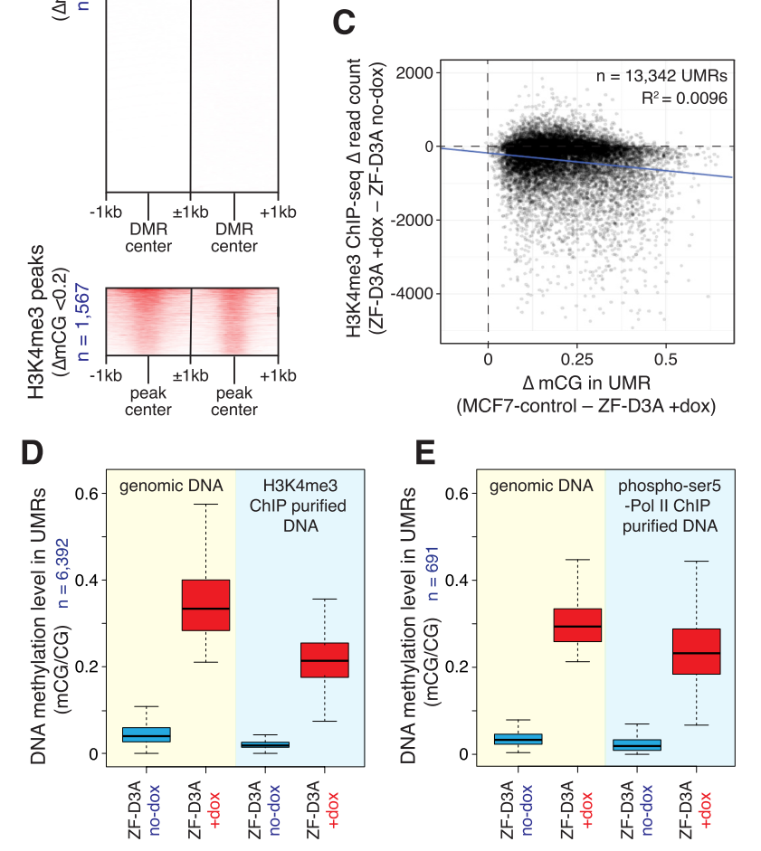

  
```{r setup, include=FALSE}
knitr::opts_chunk$set(echo = TRUE)
```
# Summary

Code to try and reproduce figure 3 from the Lister Lab paper by Ford et al., 
"Frequent lack of repressive capacity of promoter DNA methylation identified 
through genome-wide epigenomic manipulation" (
available on [BioRxiv](https://www.biorxiv.org/content/early/2017/09/20/170506)).

# Workspace Setup

First we load the necessary packages.

```{r, workspace, message=FALSE, warning=FALSE}
library(data.table)
library(dplyr)
library(tidyr)
library(GenomicRanges)
library(ggplot2)
library(R.utils)
library(DESeq2)
library(annotatr)
library(rtracklayer)
library(BiocParallel)
library(bsseq)
library(cowplot)
library(GEOquery)
library(SRAdb)
library(Rsamtools)
library(readr)
library(GenomicAlignments)

# data directory
datdir <- "../DATA"
fqdir <- file.path(datdir, "RAW")
tmpdir <- file.path(fqdir, "TEMP")
dir.create(datdir, showWarnings = FALSE)
dir.create(fqdir, showWarnings = FALSE)
dir.create(tmpdir, showWarnings = FALSE)

# rscript directory
rdir <- "../R/"
sourceDirectory(rdir)

# results directory
resdir <- "../RESULTS"
dir.create(resdir, showWarnings = FALSE)

# parallel backend
ncores <- 6
register(MulticoreParam(workers=ncores))

# path to where TrimGalore! tool is installed
trimgalorepath <- "~/trim_galore_zip/trim_galore"

# path to where picard-tools is installed
picardpath <- "/n/sw/fasrcsw/apps/Core/picard/2.9.0-fasrc01"

# path to where bismark is installed
bismarkpath <- "~/bin/Bismark"
```

# Data download

First download the relevant Supplementary Tables (S1, S2, S3, and S4) from the BioRxiv site.

```{r, downloadSupp}
download.file(url = "https://www.biorxiv.org/highwire/filestream/57972/field_highwire_adjunct_files/0/170506-1.txt",
              destfile =  file.path(datdir, "170506-1.txt"))

download.file(url = "https://www.biorxiv.org/highwire/filestream/57972/field_highwire_adjunct_files/1/170506-2.txt",
              destfile =  file.path(datdir, "170506-2.txt"))

download.file(url = "https://www.biorxiv.org/highwire/filestream/57972/field_highwire_adjunct_files/2/170506-3.txt",
              destfile = file.path(datdir, "170506-3.txt"))

download.file(url = "https://www.biorxiv.org/highwire/filestream/57972/field_highwire_adjunct_files/3/170506-4.txt",
              destfile =  file.path(datdir, "170506-4.txt"))
```

Next we download the RNA-seq count table from GEO (accession number GSE102395)

```{r, downloadGEO}
# expression counts
file <- file.path(datdir, "GSE102395_MCF7_ZF_DNMT3A_countstable.txt")

if (!file.exists(file)){
  download.file(url = "ftp://ftp.ncbi.nlm.nih.gov/geo/series/GSE102nnn/GSE102395/suppl/GSE102395%5FMCF7%5FZF%5FDNMT3A%5Fcountstable%2Etxt%2Egz",
              destfile = file.path(file, ".gz"))
  gunzip(paste0(file, ".gz"))
}
```

Finally, we download the ChIP-BS data for H3K4Me3 and RNA Pol II  
from the same GEO accession number 
as the RNA-seq count table. We'll parse the provided `allC` files to 
extract only the cytosines at CpGs.

```{r, downloadGEO2}
# first the ChIP-BS data for PolII and H3K4Me3 count tables
meta = pData(phenoData(getGEO("GSE102395")[[1]]))
filePaths <- as.character(meta$supplementary_file_1[grepl("H3K4", meta$characteristics_ch1.2) |
                                                    grepl("polymerase", meta$characteristics_ch1.2)])

for (file in filePaths){
  fi <- file.path(datdir,
              sapply(strsplit(file, "/"), function(x) x[length(x)]))
  err <- gsub(".gz", "", fi)
  if (!file.exists(fi) && !file.exists(gsub(".gz", "", fi))){
    download.file(url = file, destfile = fi)
  }
   
  if (!file.exists(gsub(".gz", "", fi))){
    err <- try(gunzip(fi), silent = TRUE) 
  }
  
  if (err==gsub(".gz", "", fi)){
    message("Downloaded and unzipped file ", fi)
    
    if (!file.exists(gsub("allC", "CpG", gsub(".gz", "", fi)))){
      system(paste0("awk '($5 == \"CG\")' ", gsub(".gz", "", fi),
                  " > ", gsub("allC", "CpG", gsub(".gz", "", fi))))
    }
    message("CpGs filtered for file ", gsub("allC", "CpG", gsub(".gz", "", fi)))
  }else{
    message(err)
    message("Skipping file ", fi, " since it is corrupt.")
    file.remove(fi)
  }
}

# next the ChIP bigWig data for H3K4Me3
filePaths <- as.character(meta$supplementary_file_1[grepl("H3K4me3_ChIP.bigWig",
                                                          meta$supplementary_file_1)])
for (file in filePaths){
  fi <- file.path(datdir,
              sapply(strsplit(file, "/"), function(x) x[length(x)]))
  err <- gsub(".gz", "", fi)
  if (!file.exists(fi) && !file.exists(gsub(".gz", "", fi))){
    download.file(url = file, destfile = fi)
  }
}

# next the raw ChIP-seq data 
meta = pData(phenoData(getGEO("GSE102395")[[1]]))
srxs <- meta[grepl("H3K4", meta$characteristics_ch1.2) |
             grepl("polymerase", meta$characteristics_ch1.2),]
dataset <- ifelse(grepl("H3K4", srxs$`antibody:ch1`), "H3K4", "PolII")
grouping <- ifelse(grepl("noDOX|noDox", srxs$source_name_ch1), "Ctrl", "Meth")
srxs <- unlist(lapply(strsplit(as.character(srxs$relation.1), "="), 
                      function(x) x[2]))

## Get DB (might take few minutes) for querying SRRs from SRXs
sqlfile <- file.path(datdir,
                    paste("SRAmetadb.sqlite.gz", sep= '.'))
if (!file.exists(gsub(".gz", "", sqlfile))){
  getSRAdbFile(sqlfile)
}
sra_con<- dbConnect(SQLite(), gsub(".gz", "", sqlfile))

# fastq-dump
all.sra <- NULL
for (srx in srxs) {
    sra <- dbGetQuery(sra_con, paste0("select experiment_accession, run_accession from sra where experiment_accession = '", srx, "'"))$run_accession
  
 if(!file.exists(file.path(fqdir, paste0(sra, ".fastq")))){
    message("fastq-dump of ", sra)
    code <- system(paste0("fastq-dump ", sra, " --outdir ", fqdir))
    stopifnot(code==0L)
  }else{
    message("fastq-dump of ", sra, " already completed.")
  }
  all.sra <- c(all.sra, sra)
}
all.fastq <- paste0(all.sra, ".fastq")

# fastqc
for (fi in all.fastq){
  if (!file.exists(file.path(fqdir, gsub(".fastq", "_fastqc.html", fi)))){
   system(paste0("fastqc ", file.path(fqdir, fi), " -o ", fqdir))
  }
}

# quality / adapter trimming 
for (fi in all.fastq){
  if (!file.exists(file.path(fqdir, gsub(".fastq", "_trimmed.fq", fi)))){
   system(paste0(trimgalorepath, " ", file.path(fqdir, fi), " -o ",
                 fqdir, " --fastqc"))
  }
}

# download assembly
assemblyfile <- file.path(fqdir, "hg19.assembly.fa")

if (!file.exists(assemblyfile)){
  if (!file.exists(paste0(assemblyfile, ".gz"))){
  download.file(url = "ftp://ftp.ensembl.org/pub/grch37/release-92/fasta/homo_sapiens/dna/Homo_sapiens.GRCh37.dna.primary_assembly.fa.gz",
                destfile = paste0(assemblyfile, ".gz"))
  }
  gunzip(filename = paste0(assemblyfile, ".gz"),
         destname = assemblyfile)
}
```

# Process ChIP-seq data

We proceed with processing the ChIP-seq data. The fastq files and reference 
assembly have been downloaded
and now the reads need to be mapped to the reference genome in order to obtain bam files.
We first generate an index reference genome, and then use Bismark to perform the
mapping in a bisulfite-conversion aware manner.

```{r, processchip}
# build index genome for bismark -- version v0.17.0
indexDir <- file.path(fqdir, "Bisulfite_Genome")
if (!file.exists(file.path(indexDir, "GA_conversion/BS_GA.rev.2.bt2"))){
  system(paste0(file.path(bismarkpath, "bismark_genome_preparation"), " --bowtie2 ", fqdir ))
}

bam.files <- file.path(fqdir, paste0(all.sra, "_trimmed_bismark_bt2.bam"))
all.fastq <- file.path(fqdir, gsub(".fastq", "_trimmed.fq", 
                                   paste0(all.sra, ".fastq")))
for (b in seq_along(bam.files)){
  tmpfiles <- list.files(path = tmpdir, pattern = paste0(basename(bam.files[b]), ".temp"), 
                         full.names = TRUE)
  tmpfiles <- c(tmpfiles, list.files(path = tmpdir, 
                                     pattern = paste0(basename(all.fastq[b]), ".temp"),
                                     full.names = TRUE))
  if (!file.exists(bam.files[b]) || length(tmpfiles) > 0){
    # cleanup
    if (length(tmpfiles) > 0){
      file.remove(tmpfiles)
    }
    
    if (file.exists(bam.files[b])){
      file.remove(bam.files[b])
    }
    
    # run bismark
    system(paste0(file.path(bismarkpath, "bismark"), " --bowtie2 --multicore ",
                  ncores, " --fastq ",
                  "--bam -o ", fqdir, " --temp_dir ", tmpdir, " ", 
                  fqdir, " ", all.fastq[b]))
  }
}

# don't need to extract the methylation estimates since already have them from
# GEO, but probably will just to be consistent.
# 
#bismark_methylation_extractor -p --no_overlap --comprehensive --merge_non_CpG -o $OUTDIR --multicore 10 --buffer_size 20G --counts --bedGraph --gzip --cytosine_report --genome_folder $REFDIR $OUTDIR/$bamfile


# set $covfile to be filename of bisark.cov.gz
#covfile=$OUTDIR/$SAMPNAME\.CpG_report.txt.CpG_report.txt.gz

#R CMD BATCH --no-restore --no-save /rafalab/keegan/PRCA/PROCESS/scripts/cov_to_bsseq.R $OUTDIR/$SAMPNAME\.Rout


# sort bamfiles
bam.files <- file.path(fqdir, paste0(all.sra, "_trimmed_bismark_bt2.bam"))
bam.files.sort <- file.path(fqdir, paste0(dataset,"_", grouping, 
                                          "_trimmed_bismark_bt2_sorted.bam"))
for (bf in seq_along(bam.files)){
  if (!file.exists(bam.files.sort[bf])){
    message("Sorting bam file: ", bam.files[bf])
    system(paste0("samtools sort ", bam.files[bf], " -@ ", ncores, " -o ", 
                  bam.files.sort[bf]))
  }else{
    message("Bam file ", bf, " already sorted.")
  }
}

# check the proportion of 'marked' reads by picard (potential PCR duplicates)
# these will be counted & summarized to understand mapping statistics
temp.bam <- file.path(fqdir, "chipseq_temp.bam")
temp.file <- file.path(fqdir, "chipseq_metric.txt")
temp.dir <- file.path(fqdir, "chipseq_working")
dir.create(temp.dir, showWarnings = FALSE)
for (bam in bam.files.sort) {
   code <- system(paste0("java -jar ", file.path(picardpath, "picard.jar"), " ",
        sprintf("MarkDuplicates I=%s O=%s M=%s \\
        TMP_DIR=%s AS=true REMOVE_DUPLICATES=false \\
        VALIDATION_STRINGENCY=SILENT", bam, temp.bam,   
        temp.file, temp.dir)))
    stopifnot(code==0L)
    file.rename(temp.bam, bam)
}

# create bedGraph coverage files
#  bedtools genomecov -ibam H3K4_Ctrl.bam -bga > H3K4_Ctrl.bedGraph

# diagnostics of mapping 
logfile <- file.path(fqdir, "mappingstats_bismark.rds")

if (!file.exists(logfile)){
  diagnostics <- list()
  for (bam in bam.files.sort) {
    total <- countBam(bam)$records
    mapped <- countBam(bam, param=ScanBamParam(
        flag=scanBamFlag(isUnmapped=FALSE)))$records
    marked <- countBam(bam, param=ScanBamParam(
        flag=scanBamFlag(isUnmapped=FALSE, isDuplicate=TRUE)))$records
    diagnostics[[bam]] <- c(Total=total, Mapped=mapped, Marked=marked)
  }

  diag.stats <- data.frame(do.call(rbind, diagnostics))
  diag.stats$Prop.mapped <- diag.stats$Mapped/diag.stats$Total*100
  diag.stats$Prop.marked <- diag.stats$Marked/diag.stats$Mapped*100
  
  saveRDS(diag.stats, file=logfile)
}else{
  diag.stats <- readRDS(file=logfile)
}
diag.stats
```

Next, we'll perform peak calling using MACS2.

```{r, macs}
bedfiles <- file.path(datdir, paste0(dataset,"_", grouping, "_peaks.xls"))

for(bf in seq_along(bedfiles)){
  if (!file.exists(bedfiles[bf])){
    system(paste0("macs2 callpeak -t ", 
                  bam.files.sort[bf], 
                  " -g 2.7e9 --outdir ", datdir, " -n ", 
                  basename(gsub("_peaks.xls", "", bedfiles[bf]))))
  }
}

```

# Read in supplementary data tables

Now we'll read in the Supplementary data tables. Table S1 contains the off-target 
binding sites of ZF-D3A. Table S2 contains information 
about the DMRs. Table S3 contains information about the UMRs (unmethylated regions).
Table S4 also contains associations between UMRs and DE genes (there is no analogous
table for DMRs, so we'll have to construct one ourselves).

Note that the column names for Tables S2 and S3 are missing one, so we'll have to 
read these in with `header=FALSE` and manually add them. Here we infer that the missing
column name is for column 12 (contains 'geneBody' or 'non-geneBody'), and we name
it "genebody_classification".

Additionally, we need to
manually skip the first 1-2 lines of tables S3 and S4 since they contain multiple lines starting with
`#` that don't contain data.

Also note that for Table S3, missing data is denoted as a character string `noData`,
so we convert these values to `NA`. 

In addition, for Table S4 there is a cell with numeric values that contains a `$` 
in it. This is presumed to be a mistake, since this is not present in earlier
submitted versions of the table on BioRxiv. We remove this row from analysis.

```{r, readSupp}
ts1 <- fread(file.path(datdir, "170506-1.txt"), header=FALSE, skip=1)  #ZF Binding sites
colnames(ts1) <- c("chr", "start", "end", "closest_gene_promoter", 
                   "distance_to_nearest_promoter", "promoter_classification",
                   "CpGisland_classification", "genebody_classification",
                   "enhancer_classification")


ts2 <- fread(file.path(datdir, "170506-2.txt"), header=FALSE)  #DMRs
colnames(ts2) <- c("chr", "start", "end", "number_of_CpG_cytosines_in_region",
                   "methylation_level_in_MCF7_control", "methylation_level_in_ZF_D3A_plus_dox",
                   "methylation_level_in_ZF_D3A_dox_wd", "closest_gene_promoter",
                   "distance_to_nearest_promoter", "promoter_classification",
                   "CpGisland_classification", "genebody_classification",
                   "enhancer_classification")

ts3 <- fread(file.path(datdir, "170506-3.txt"), header=FALSE, skip=1)  #UMRs
colnames(ts3) <- colnames(ts2)
ts3 <- ts3 %>%
  mutate(methylation_level_in_ZF_D3A_dox_wd = 
           as.numeric(ifelse(methylation_level_in_ZF_D3A_dox_wd == "noData", NA, 
                  methylation_level_in_ZF_D3A_dox_wd)))

ts4 <- fread(file.path(datdir, "170506-4.txt"), header=TRUE, skip=1)  #UMRs II
colnames(ts4) <- gsub("#", "", colnames(ts4))
ts4 <- ts4 %>%
  mutate(`FoldChange_RNAseq(MCF7_control/ZF_D3A_plusDox)` =
           as.numeric(`FoldChange_RNAseq(MCF7_control/ZF_D3A_plusDox)`)) %>%
  na.omit()
```

# Read in ChIP-BS data

Here we read in the ChIP-BS data, which according to GEO has the following format:
>> For the ChIP-BS-seq data the 'allC' file format is a tab-delimited text file with the following columns: 1) chromosome, 2) position, 3) position, 4) strand, 5) context, 6) cytosine base calls, and 7) all base calls.

```{r, read.lister}
# h3k4 chip bs data
bfile <- file.path(datdir, "bsseq_h3k4me3.rds")
files <- list.files(datdir, pattern = "BS.CpG.txt", full.names = TRUE)
if (!file.exists(bfile)){
  hfiles <- files[grepl("H3K4", files)]
  bs.h3k4 <- read.lister(hfiles, sampleNames = hfiles, rmZeroCov = TRUE,
                    strandCollapse = TRUE, mc.cores = ncores,
                    chipBS = TRUE)
  if ("BSseq" %in% class(bs)){
    saveRDS(bs.h3k4, bfile)
  }
}else{
  bs.h3k4 <- readRDS(bfile)
}

# polII chip bs data
bfile <- file.path(datdir, "bsseq_polII.rds")
if (!file.exists(bfile)){
  pfiles <- files[grepl("PolII", files)]
  
  bs.pol <- read.lister(pfiles, sampleNames = pfiles, rmZeroCov = TRUE,
                    strandCollapse = TRUE, mc.cores = ncores,
                    chipBS = TRUE)
  if ("BSseq" %in% class(bs)){
    saveRDS(bs.pol, bfile)
  }
}else{
  bs.pol <- readRDS(bfile)
}

sampleNames(bs.h3k4) <- ifelse(grepl("noDOX", sampleNames(bs.h3k4)), 
                               "noDOX", "DOX")
sampleNames(bs.pol) <- ifelse(grepl("noDOX", sampleNames(bs.pol)), 
                               "noDOX", "DOX")

show(bs.h3k4)
show(bs.pol)
```

Finally, we'll read in the ChIP bigWig data

```{r, bigwig}
bwfiles <- list.files(datdir, pattern="bigWig", full.names = TRUE)
is.control <- grepl("noDOX", bwfiles)
chip.dox <- import(bwfiles[!is.control], as="Rle")
chip.ctrl <- import(bwfiles[is.control], as="Rle")
```

# Reproduce Figure 3C, D and E

With the tables in hand, we attempt to reproduce Figure 3 from the manuscript.
Below is a screenshot of what this figure looks like. 



Note that the x-axis in Figure 3C is mislabeled. The change in $\Delta$mCG is computed
as +Dox - control (since the dox induces methylation, and most values are positive).
This Figure is used make some pretty bold claims. For example, the manuscript states that

> These data demonstrate that forced DNA methylation is not sufficient to disrupt H3K4me3 occupancy or the interaction of initiated RNA polymerase II with genomic DNA.

In more detail, this statement is backed up by the following details regarding Figure 3

> Notably, there is no correlation between the change in DNA methylation and the level of H3K4me3 in UMRs (Fig. 3C).

> In DNA purified by H3K4me3 ChIP in ZF-D3A +dox, 21% of CpGs within the 6,392 H3K4me3 peaks were methylated, demonstrating that H3K4me3 and DNA methylation can exist simultaneously at the same site upon forced induction of DNA methylation (Fig. 3D). 

> Importantly, phospho-Ser5 RNA pol II was clearly able to directly interact with ZF-D3A methylated DNA (Fig. 3E)

## Reproduce Figure 3C

We first start with Figure 3C, the scatterplot of methylation difference and
difference in H3K4me3. In the manuscript, the normalization of H3K4me3 is described
as follows: 

> To account for variations in ChIP efficiency, the two ChIP-seq data sets were normalized by the number of reads mapped to H3K4me3 peaks that had a ∆mCG <0.2 between ZF-D3A no-dox and ZF-D3A +dox cells.

However, since we do not have access to the peaks called by MACS (email request sent to 
first author Ethan Ford on 5/2/2018), 
we have processed them ourselves.

First we need to normalize the H3K4 data by examining total read counts in common peaks
that correspond to lowly methylated regions in both conditions. Following
Ford et al., we'll use the center 100 bps of common peaks. We'll annotate them with
the average methylation level in treatment and control, and select those where both
numbers are less than 0.20 (although it seems the authors did not distinguish 
treatments for this calculation). Then we'll count up the number of reads in each
of the remaining peaks. For downstream analyses, read counts are scaled by the size
factor from this total. 

```{r, normalizeH3K4}
# read in called peaks from macs
peaks.all <- NULL
for (bf in bedfiles[grepl("H3K4", bedfiles)]){
  # import peak bed files as GRanges
  peaks <- read_tsv(bf, comment = "#", skip = 1, guess_max = 5e5) %>%
                                mutate(condition = basename(bf))
  if (length(peaks.all) > 0){
    peaks.all <- GRangesList(peaks.all, makeGRangesFromDataFrame(peaks))
  }else{
    peaks.all <- makeGRangesFromDataFrame(peaks)
  }
}

# find common peaks and use intersection boundaries
ol <- findOverlaps(peaks.all[[1]], peaks.all[[2]])
peaks.all <- GRangesList(peaks.all[[1]][ol@from], 
                         peaks.all[[2]][ol@to])
peaks.common <- peaks.all[[1]]
start(peaks.common) <- pmin(start(peaks.all[[1]]), start(peaks.all[[2]]))
end(peaks.common) <- pmax(end(peaks.all[[1]]), end(peaks.all[[2]]))

# subset on common peaks at least 5kb away from ZF binding site
seqlevels(peaks.common) <- paste0("chr", seqlevels(peaks.common))
seqlevels(peaks.common) <- gsub("chrGL", "GL", seqlevels(peaks.common))
ol <- findOverlaps(peaks.common, 
                   resize(makeGRangesFromDataFrame(ts1), 
                         width = 5000 + width(makeGRangesFromDataFrame(ts1)), 
                         fix = "center"))
peaks.common <- peaks.common[-unique(ol@from),]

# subset on common peaks with low methylation (< 0.2 in ctrl and dox)
#load bsseq data (processed in MethylationCountsAnalysis.Rmd)
bs <- readRDS(file.path(datdir, "bsseq.rds"))
bs <- bs[,pData(bs)$dox != "Dox Withdrawal" | pData(bs)$condition == "Control"]

cov.mat <- getCoverage(bs, type="Cov")
filter <- pmax( 1*(DelayedMatrixStats::rowSums2(cov.mat[,pData(bs)$condition == "Control"]) < 5),
                1*(DelayedMatrixStats::rowSums2(cov.mat[,pData(bs)$condition == "Methylated"]) < 5))
filter <- which(filter > 0)
bs <- bs[-filter,]
rm(cov.mat)

ol <- as.data.frame(findOverlaps(peaks.common, bs)) %>%
      group_by(queryHits) %>% 
      summarize(s = min(subjectHits),
                e = max(subjectHits))
indexRanges <- IRanges(ol$s, ol$e)
prop.mat <- getCoverage(bs, type = "M")/getCoverage(bs, type = "Cov")
prop.mat <- extractROWS(prop.mat, indexRanges)

mean.ctrl <- DelayedMatrixStats::rowMeans2(prop.mat[,
            pData(bs)$condition=="Control"], na.rm = TRUE)
mean.meth <- DelayedMatrixStats::rowMeans2(prop.mat[,
            pData(bs)$condition=="Methylated"], na.rm = TRUE)
mean.ctrl <- IRanges::mean(IRanges::relist(mean.ctrl, indexRanges), na.rm = TRUE)
mean.meth <- IRanges::mean(IRanges::relist(mean.meth, indexRanges), na.rm = TRUE)
peaks.common <- peaks.common[which(mean.ctrl < 0.2 & mean.meth < 0.2), ]
#peaks.common <- peaks.common[ol$queryHits[which(abs(mean.ctrl - mean.meth) < 0.2)], ]

# Just use center 100bps 
peaks.common <- resize(peaks.common, width = 100, fix = "center")

# Count up reads in bamfiles landing in common peaks
# create a BamFileList object
bamfiles <- list.files(fqdir, pattern="*.bam", full.names = TRUE)
bamfiles <- bamfiles[file.info(bamfiles)$size > 0 & grepl("H3K4", bamfiles) &
                     !grepl("indel", bamfiles)]
bfL <- BamFileList(bamfiles, index = character())

# summarizeOverlaps with "union"
seqlevels(peaks.common) <- gsub("chr", "", seqlevels(peaks.common))
rse <- summarizeOverlaps(peaks.common, bfL, mode = "Union")
totalReads <- colSums(assays(rse)$counts)
sizeFactors <- totalReads/median(totalReads)

```

Next, we need to find overlaps between the UMRs and H3K4me3 reads.

```{r, intersectchip}
umrs <- makeGRangesFromDataFrame(ts3)
seqlevels(umrs) <- gsub("chr", "", seqlevels(umrs))
umrs <- resize(umrs, width = 5000, fix = "center")
rse <- summarizeOverlaps(umrs, bfL, mode = "Union")
assays(rse)$normcounts <- t(apply(assays(rse)$counts, 1,
                                function(x) x / sizeFactors))

# add counts to UMR dataframe
ts3 <- ts3 %>% 
  mutate(chip.dox.norm = assays(rse)$normcounts[,grepl("Meth", colnames(rse))],
         chip.ctrl.norm = assays(rse)$normcounts[,grepl("Ctrl", colnames(rse))],
         chip.dox = assays(rse)$counts[,grepl("Meth", colnames(rse))],
         chip.ctrl = assays(rse)$counts[,grepl("Ctrl", colnames(rse))],
         delta_H3K4me3 = chip.dox - chip.ctrl,
         detla_H3K4me3 = chip.dox.norm - chip.ctrl.norm,
         delta_mC = methylation_level_in_ZF_D3A_plus_dox - methylation_level_in_MCF7_control)
```

Next, we construct the scatter plot of methylation change in UMRs versus normalized
difference in H3K4me3 ChIP-Seq normalized read counts. 

```{r, fig3c}
# raw read counts
ggplot(ts3 %>% filter(delta_mC > 0), 
             aes(y = log2(chip.dox+1) - log2(chip.ctrl+1), x = delta_mC)) +
  geom_hline(yintercept=0, col="black") +
  geom_hline(yintercept=0, col="white", linetype="dashed") +
  geom_point(size=0.5, alpha=0.75) + 
  theme_bw() +
  xlab(expression(paste(Delta, "mCG in UMR (dox - no dox)"))) +
  ylab(expression(paste(Delta, "log2 H3K4me3 readcount (dox - no dox)"))) +
  geom_smooth()

# normalized
ggplot(ts3 %>% filter(delta_mC > 0), 
             aes(y = log2(chip.dox.norm+1) - log2(chip.ctrl.norm+1), x = delta_mC)) +
  geom_hline(yintercept=0, col="black") +
  geom_hline(yintercept=0, col="white", linetype="dashed") +
  geom_point(size=0.5, alpha=0.75) + 
  theme_bw() +
  xlab(expression(paste(Delta, "mCG in UMR (dox - no dox)"))) +
  ylab(expression(paste(Delta, "log2 H3K4me3 readcount (dox - no dox)"))) +
  geom_smooth()
```

As an alternative, we can use the bigWig coverage data to generate a similar plot.

```{r, fig3c-bigwig}
# unify seqnames (chip has MT but UMRs don't)
chip.dox <- chip.dox[seqlevels(makeGRangesFromDataFrame(ts4))]
chip.ctrl <- chip.ctrl[seqlevels(makeGRangesFromDataFrame(ts4))]

chip <- binnedAverage(makeGRangesFromDataFrame(ts4), chip.dox, "dox")
chip$ctrl <- binnedAverage(makeGRangesFromDataFrame(ts4), chip.ctrl, "ctrl")$ctrl

ts4 <- ts4 %>%
  filter(delta_mC > 0) %>%
  mutate(sig = fdr_RNAseq < 0.05,
         chip.dox = chip$dox/sizeFactors[2],
         chip.ctrl = chip$ctrl/sizeFactors[1],
         delta_H3K4me3 = chip$dox - chip$ctrl)

p1 <- ggplot(ts4, aes(y = log2(chip.dox+1) - log2(chip.ctrl+1), x = delta_mC)) +
  geom_hline(yintercept=0, col="black") +
  geom_hline(yintercept=0, col="white", linetype="dashed") +
  geom_point(size=0.5, alpha=0.75) + 
  theme_bw() +
  xlab(expression(paste(Delta, "mCG in UMR (dox - no dox)"))) +
  ylab(expression(paste(Delta, "log2 H3K4me3 readcount (dox - no dox)"))) +
  geom_smooth()
```

The figure is similar in spirit to the one in the paper, but the one in the paper
has much more variability in the spread of the points. One other point of difference
is that it seems they expanded the boundary of UMRs to +/- 2.5kb (but there are 
contradictions in the description of the method, so it's hard to tell).

## Reproduce Figure 5D and E

Next we try Figure 5D-E, the boxplots of methylation level in UMRs in DNA versus 
in H3K4me3 / DNA Polymerase II ChIP-ed DNA.

To do so, we need to intersect the ChIP-BS data with the UMRs. We'll also compare
to the same overlap in the WGBS data, so we'll load that in (see the 
`methylationCountAnalysis.Rmd` for details on how that data is downloaded and 
processed).

```{r, fig5b, fig.height=4, fig.width=7}
# "peaks" -- simple cutoff on bigWig for now; TODO: use a peak caller & normalize
peaks.dox <- import(bwfiles[!is.control])
peaks.dox <- peaks.dox[score(peaks.dox) > 80]
peaks.ctrl <- import(bwfiles[is.control])
peaks.ctrl <- peaks.ctrl[score(peaks.ctrl) > 80]
peaks.h3k4 <- intersect(peaks.dox, peaks.ctrl)

# intersect the UMRs with the peaks
h3k4.UMRs <- unique(findOverlaps(peaks.h3k4, makeGRangesFromDataFrame(ts4))@to)

# intersect the peak-UMRs with chipbs
int.h3k4 <- bs.h3k4[findOverlaps(bs.h3k4, makeGRangesFromDataFrame(ts4[h3k4.UMRs,]))@from,]
int.pol <- bs.pol[findOverlaps(bs.pol, makeGRangesFromDataFrame(ts4))@from,]

# compute methylation proportions
prop <- as.data.frame(getMeth(int.h3k4, type="raw")) %>% 
  mutate(region = findOverlaps(bs.h3k4, makeGRangesFromDataFrame(ts4))@to) %>%
  na.omit() %>%
  gather("Group", "Meth", 1:2) %>%
  mutate(type = "H3K4me3") %>% 
  group_by(region, Group, type) %>%
  summarize(Meth = mean(Meth))

prop <- bind_rows(prop, 
  as.data.frame(getMeth(int.pol, type="raw")) %>% 
    mutate(region = findOverlaps(bs.pol, makeGRangesFromDataFrame(ts4))@to) %>%
    na.omit() %>%
    gather("Group", "Meth", 1:2) %>%
    mutate(type = "RNA Polymerase II") %>% 
    group_by(region, Group, type) %>%
    summarize(Meth = mean(Meth)) )

# add UMR 
prop <- bind_rows(prop,
  ts4 %>% select(mC_MCF7_control_mC, ZF_D3A_plusDox_mC) %>%
    gather("Group", "Meth", 1:2) %>%
    mutate(Group = ifelse(Group == "mC_MCF7_control_mC", "noDOX", "DOX"),
           type = "WGBS",
           region = 1:n()) %>%
    select(region, Group, type, Meth))

# plot
p <- ggplot(prop, aes(x = type, y = Meth, fill = Group)) +
  geom_boxplot() + 
  theme_classic() + 
  xlab("Chip-BS") +
  ylab("Average methylation proportion")

plot_grid(p1, p, ncol=1)

```

The figure has some slight differences in numbers, but overall is quite close to the
figure in the paper.

How many genes had a Decrease compared to an increase overall?

```{r}
de_dn <- sum(ts4b$`FoldChange_RNAseq(MCF7_control/ZF_D3A_plusDox)` < 1)
de_up <- sum(ts4b$`FoldChange_RNAseq(MCF7_control/ZF_D3A_plusDox)` > 1)
```

Looks like there are `r de_dn` decreased genes and `r de_up` increased genes, where
the proportion decreased is `r signif(de_dn / (de_dn + de_up),3)` and the odds of decrease is
`r signif(de_dn / de_up,3)`.

# Alternate versions of Figure 3

Next we'll try and create alternate versions of these Figures to understand the
lack of a trend displayed and evaluate whether the (rather strong) conclusion
about the lack of influence of methylation on expression holds.

## Alternate versions of Figure 3C

First we examine a standard M-A plot to understand the expression magnitude
and log-FC differences in this dataset.

## Alternate versions of Figure 3D-E

We'd like to make Figure 5B by stratifying by DE significance.

How many DE genes had a decrease compared to an increase overall?

# Making Figure 3 for DMRs instead of UMRs

We also wish to redo Fig 5A with DMRs, instead of UMRs as done in the paper.
The justification for using UMRs seems to be that they capture the promoters 
better, but then it seems that methylation differences might not be properly
captured. Seeing as this is our primary interest, i.e. to look at expression
changes where there are methylation differences, we'll make a Figure 5A and B
type plot for associating DMRs with expression.
This means we need to run the DE analysis and associate genes with
DMRs by overlapping up to 2kb away from promoter region.

Note that here we are starting with the set of DMRs provided by Table S2, 
which may not be the best approach but saves time in getting the lower level 
data and processing it. These DMRs were obtained using DSS using very liberal
thresholds (0.05 and 0.005 compared to the default and recommended threshold 
of 1e-5). 

## DE analysis

First we need to run the differential expression analysis. 

```{r, expressionEDA, fig.width=8, fig.height=4}
exp <- fread(file.path(datdir, "GSE102395_MCF7_ZF_DNMT3A_countstable.txt"))

# There are duplicate genes -- looks like a classic excel conversion error -- remove these
dup <- which(table(exp$gene) > 1)
names(dup)
exp <- exp %>% filter(!(gene %in% names(dup)))

# move genes to rownames  
rownames(exp) <- exp$gene
exp <- as.matrix(exp %>% dplyr::select(-gene))
allZero <- rowSums(exp==0)==ncol(exp)
exp <- exp[!allZero,]

# strings to match the two comparison samples - control and ZF + DOX
ctrl <- "MCF7_emptyVector"
trt <- "MCF7_ZF_DNMT3A_DOX_rep"

# set up colData
coldata <- data.frame(sample=colnames(exp)) %>%
  mutate(condition = ifelse(grepl(ctrl, sample), "Control",
                     ifelse(grepl(trt, sample), "Methylated", "Other"))) 

dds <- DESeqDataSetFromMatrix(countData = exp,
                              colData = coldata,
                              design = ~ condition)
dds <- dds[, dds$condition != "Other"]
dds$condition <- droplevels(dds$condition)
dds <- estimateSizeFactors(dds)

# plot distribution of expression values
exp <- data.frame(counts(dds)) %>% 
  gather(sample, count) %>% 
  mutate(normcount = (data.frame(counts(dds, normalize=TRUE)) %>% 
           gather(sample, count))$count) %>%
  mutate(condition = ifelse(grepl(ctrl, sample), "Control", "Methylated")) %>%
  mutate(dox = ifelse(grepl("noDOX", sample), "No Dox", 
                      ifelse(grepl("DOXremoval", sample), "Dox withdrawal", 
                             "Dox")))
  
ggplot(exp, aes(x=count+1, group=sample, color=condition)) +
  geom_density(adjust=0.75) +
  scale_x_continuous(trans="log2") +
  theme_bw() + 
  ggtitle("Smoothed density of raw counts")

ggplot(exp, aes(x=count+1, group=interaction(dox, condition), color=condition)) +
  geom_density(adjust=0.75, aes(linetype=dox)) +
  scale_x_continuous(trans="log2") +
  theme_bw() + 
  ggtitle("Smoothed density of raw counts")

ggplot(exp, aes(x=normcount+1, group=interaction(dox, condition), color=condition)) +
  geom_density(adjust=0.75, aes(linetype=dox)) +
  scale_x_continuous(trans="log2") +
  theme_bw() + 
  ggtitle("Smoothed density of normalized counts")

```

There could be an effect of dox on the control cell line - the dox control group
looks very similar to the methylated group, and the dox withdrawal group has higher 
expression (but withdrawal and no dox groups are in opposite order).

Going forward, we'll use only the no dox control versus the dox methylated group
for the DE comparison. In addition, since we observe global shifts in the expected
direction (i.e. lower expression for the methylated condition), we will not perform
standard normalization.

```{r, deseq}
dds <- dds[, dds$condition == "Methylated" | 
             (dds$condition == "Control" & grepl("noDOX", dds$sample)) ]
sizeFactors(dds) <- 1
dds <- DESeq(dds)
res <- results(dds)

sum(res$padj < 0.01, na.rm = TRUE)
res <- res %>% na.omit()
```
## Associate DMRs with genes

Next we need to associate each DMR with a gene by checking overlap with promoters.
We'll grab the promoter annotation using annotatr.

```{r, annotatr}
annot = build_annotations(genome = 'hg19', annotations = 'hg19_genes_promoters')
ol <- distanceToNearest(makeGRangesFromDataFrame(ts2), annot)

dmrs <- ts2[ol@from[mcols(ol)$distance <= 2000],]
dmrs$gene <- annot$symbol[ol@to[mcols(ol)$distance <= 2000]]

dmrs <- dmrs %>% 
  filter(!is.na(gene))

# check overlap with UMRs
po <- sum(countOverlaps(makeGRangesFromDataFrame(dmrs),
                  makeGRangesFromDataFrame(ts4))) / nrow(dmrs)
```

These promoter-DMRs overlap highly with the UMRs (`r signif(100*po,3)`%)
Now that we have a set of DMR-Gene associations, we'll add the the DE information 
to the DMR data frame.

```{r}
# add DE results
x <- match(dmrs$gene, rownames(res)) 
dmrs <- dmrs[!is.na(x),]
x <- x[!is.na(x)]
res.dmrs <- res[x,]

dmrs <- cbind(dmrs, res.dmrs)
```

## Figure 5C for DMRs

Now we create the scatterplot like Figure 5A for dmrs.

```{r, dmrs-5a}
dmrs <- data.frame(dmrs@listData) %>% 
  mutate(sig = padj < 0.01,
         FC = 2^log2FoldChange,
         delta_mC = methylation_level_in_ZF_D3A_plus_dox -
           methylation_level_in_MCF7_control) %>%
  mutate(A = 0.5*(log2(baseMean) + 
               log2(FC*baseMean))) %>%
  mutate(ABin = ntile(A, 9)) %>%
  filter(!is.na(log2FoldChange) & !is.na(sig)) %>%
  filter(delta_mC > 0)

ggplot(dmrs, aes(x = delta_mC, y = log2FoldChange)) +
  geom_hline(yintercept=0, col="black") +
  geom_hline(yintercept=0, col="white", linetype="dashed") +
  geom_point(size=0.5, alpha=0.75, aes(color = sig)) + 
  theme_bw() + 
  xlab(expression(paste(Delta, "mCG in DMR"))) +
  ylab("log2 fold change mRNA abundance") +
  scale_color_manual(values=c("black", "red")) +
  geom_smooth(data=dmrs %>% filter(sig==TRUE)) +
  labs(color="Differentially\n Expressed")
```

From this figure it is a little more clear that most DE genes are down-regulated.
But there doesn't seem to be much of a trend for larger magnitude expression 
differences with larger magnitude methylation differences.

## Figure 5D-E for DMRs

First in the style of the paper:
```{r, dmrs-5b-orig, fig.height=4, fig.width=7}
dmrsb <- dmrs %>% 
  filter(delta_mC > 0.3) %>%
  mutate(FCcat = cut(FC,
                     breaks=c(0,0.3,0.5,0.7,0.9,1.1,Inf))) %>%
  mutate(color = ifelse(FCcat %in% c("(0.9,1.1]", "(1.1,Inf]"), "Increase", 
                        ifelse(FCcat == "(0.7,0.9]", "Small Decrease", "Decrease"))) %>%
  mutate(FCcat = factor(FCcat, levels = rev(levels(FCcat))))

ggplot(dmrsb, aes(FCcat, fill = color)) +
  geom_bar() + 
  theme_bw() + 
  scale_fill_manual(values=c("red", "blue", "darkgreen")) + 
  xlab("mRNA fold change") +
  ylab("Number of genes") +
  ggtitle("All Gene - DMR Pairs") + 
  annotate("text", x = 6, y = 750, label = paste0("n=",nrow(dmrsb))) +
  labs(fill="Direction \nof effect")
```

How many DE genes had a decrease compared to an increase overall?

```{r}
de_dn <- sum(dmrsb$log2FoldChange < 0, na.rm=TRUE)
de_up <- sum(dmrsb$log2FoldChange > 0, na.rm=TRUE)
```
Looks like there are `r de_dn` decreased DE genes and `r de_up` increased DE genes, where
the proportion decreased is `r signif(de_dn / (de_dn + de_up),3)` and the odds of decrease is
`r signif(de_dn / de_up,3)`.


Next in the improved symmetrical style and separating by DE status:
```{r,fig.height=5, fig.width=10} 
dmrsc <- dmrs %>% 
  filter(delta_mC > 0.3) %>%
  mutate(sig = padj < 0.01) %>%
  mutate(color = ifelse(log2FoldChange > 0, "Increase", "Decrease")) %>%
  mutate(FCcat = cut(log2FoldChange, breaks = c(-6,-4,-2,-1,-0.5,0,0.5,1,2,4,6))) %>%
  mutate(FCcat = factor(FCcat, levels = rev(levels(FCcat)))) %>%
  na.omit()

ggplot(dmrsc, aes(FCcat, fill = color)) +
  geom_bar() + 
  facet_wrap( ~ sig) +
  theme_bw() + 
  scale_fill_manual(values=c("red", "blue", "darkgreen")) + 
  xlab("mRNA fold change") + 
  ylab("Number of genes") +
  ggtitle("Gene - DMR Pairs by DE significance") +
  labs(fill="Direction \nof effect")
```

How many DE genes had a decrease compared to an increase overall?

```{r}
de_dn <- sum(dmrsb$sig & dmrsb$log2FoldChange < 0, na.rm=TRUE)
de_up <- sum(dmrsb$sig & dmrsb$log2FoldChange > 0, na.rm=TRUE)
```
Looks like there are `r de_dn` decreased DE genes and `r de_up` increased DE genes, where
the proportion decreased is `r signif(de_dn / (de_dn + de_up),3)` and the odds of decrease is
`r signif(de_dn / de_up,3)`.

This shows a similar result to using the UMRs - namely that DE genes are mostly 
downregulated when their promoter is demethylated.

# Session Information

```{r}
sessionInfo()
```

