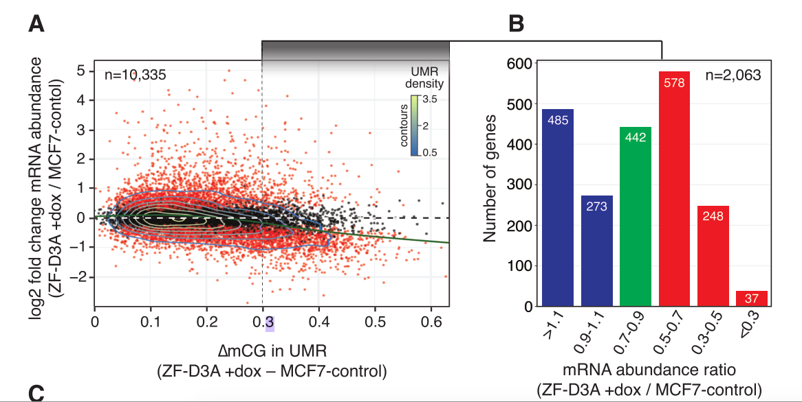

  
```{r setup, include=FALSE}
knitr::opts_chunk$set(echo = TRUE)
```
# Summary

Code to reproduce figure 5 from the paper by Ford et al., 
"Frequent lack of repressive capacity of promoter DNA methylation identified 
through genome-wide epigenomic manipulation" (
available on [BioRxiv](https://www.biorxiv.org/content/early/2017/09/20/170506)).

# Workspace Setup

First we load the necessary packages.

```{r, workspace, message=FALSE, warning=FALSE}
library(data.table)
library(dplyr)
library(tidyr)
library(GenomicRanges)
library(ggplot2)
library(R.utils)
library(DESeq2)
library(annotatr)

# data directory
datdir <- "../DATA"
dir.create(datdir, showWarnings = FALSE)
```

# Data download

First download the relevant Supplementary Tables (S1, S2, S3, and S4) from the BioRxiv site.

```{r, downloadSupp}
download.file(url = "https://www.biorxiv.org/highwire/filestream/57972/field_highwire_adjunct_files/0/170506-1.txt",
              destfile =  file.path(datdir, "170506-1.txt"))

download.file(url = "https://www.biorxiv.org/highwire/filestream/57972/field_highwire_adjunct_files/1/170506-2.txt",
              destfile =  file.path(datdir, "170506-2.txt"))

download.file(url = "https://www.biorxiv.org/highwire/filestream/57972/field_highwire_adjunct_files/2/170506-3.txt",
              destfile = file.path(datdir, "170506-3.txt"))

download.file(url = "https://www.biorxiv.org/highwire/filestream/57972/field_highwire_adjunct_files/3/170506-4.txt",
              destfile =  file.path(datdir, "170506-4.txt"))
```

Next we download the RNA-seq count table from GEO (accession number GSE102395)

```{r, downloadGEO}
# expression counts
file <- file.path(datdir, "GSE102395_MCF7_ZF_DNMT3A_countstable.txt")

if (!file.exists(file)){
  download.file(url = "ftp://ftp.ncbi.nlm.nih.gov/geo/series/GSE102nnn/GSE102395/suppl/GSE102395%5FMCF7%5FZF%5FDNMT3A%5Fcountstable%2Etxt%2Egz",
              destfile = file.path(file, ".gz"))
  gunzip(paste0(file, ".gz"))
}
```

# Read in data tables

Now we'll read in the Supplementary data tables. Table S1 contains the off-target 
binding sites of ZF-D3A. Table S2 contains information 
about the DMRs. Table S3 contains information about the UMRs (unmethylated regions).
Table S4 also contains associations between UMRs and DE genes (there is no analogous
table for DMRs, so we'll have to construct one ourselves).

Note that the column names for Tables S2 and S3 are missing one, so we'll have to 
read these in with `header=FALSE` and manually add them. Here we infer that the missing
column name is for column 12 (contains 'geneBody' or 'non-geneBody'), and we name
it "genebody_classification".

Additionally, we need to
manually skip the first 1-2 lines of tables S3 and S4 since they contain multiple lines starting with
`#` that don't contain data.

Also note that for Table S3, missing data is denoted as a character string `noData`,
so we convert these values to `NA`. 

In addition, for Table S4 there is a cell with numeric values that contains a `$` 
in it. This is presumed to be a mistake, since this is not present in earlier
submitted versions of the table on BioRxiv. We remove this row from analysis.

```{r, readSupp}
ts1 <- fread(file.path(datdir, "170506-1.txt"), header=FALSE, skip=1)  #ZF Binding sites
colnames(ts1) <- c("chr", "start", "end", "closest_gene_promoter", 
                   "distance_to_nearest_promoter", "promoter_classification",
                   "CpGisland_classification", "genebody_classification",
                   "enhancer_classification")


ts2 <- fread(file.path(datdir, "170506-2.txt"), header=FALSE)  #DMRs
colnames(ts2) <- c("chr", "start", "end", "number_of_CpG_cytosines_in_region",
                   "methylation_level_in_MCF7_control", "methylation_level_in_ZF_D3A_plus_dox",
                   "methylation_level_in_ZF_D3A_dox_wd", "closest_gene_promoter",
                   "distance_to_nearest_promoter", "promoter_classification",
                   "CpGisland_classification", "genebody_classification",
                   "enhancer_classification")

ts3 <- fread(file.path(datdir, "170506-3.txt"), header=FALSE, skip=1)  #UMRs
colnames(ts3) <- colnames(ts2)
ts3 <- ts3 %>%
  mutate(methylation_level_in_ZF_D3A_dox_wd = 
           as.numeric(ifelse(methylation_level_in_ZF_D3A_dox_wd == "noData", NA, 
                  methylation_level_in_ZF_D3A_dox_wd)))

ts4 <- fread(file.path(datdir, "170506-4.txt"), header=TRUE, skip=1)  #UMRs II
colnames(ts4) <- gsub("#", "", colnames(ts4))
ts4 <- ts4 %>%
  mutate(`FoldChange_RNAseq(MCF7_control/ZF_D3A_plusDox)` =
           as.numeric(`FoldChange_RNAseq(MCF7_control/ZF_D3A_plusDox)`)) %>%
  na.omit()
```

## Exploratory analysis

Before we go on with reproducing the Figure, first we get a sense of what is contained
in the tables. There some overlap in DMRs and UMRs, but lots of overlap between
the two UMR sets.

```{r exploratory}
dim(ts2)
dim(ts3)
dim(ts4)

head(ts2)
head(ts3)
head(ts4)

# count overlaps
sum(countOverlaps(makeGRangesFromDataFrame(ts2),
                  makeGRangesFromDataFrame(ts3))) / nrow(ts2)

sum(countOverlaps(makeGRangesFromDataFrame(ts3),
                  makeGRangesFromDataFrame(ts4))) / nrow(ts3)
```

For Table S3, all of chromosomes 10-22 have zero CpGs in the region apparently.
This has to be a mistake based on the description of how UMRs are constructed.

```{r}
table(ts3$number_of_CpG_cytosines_in_region == 0, ts3$chr)
```

Examine lengths of regions DMRs vs UMRs

```{r, regionlength}
ts2$type <- "DMR"
ts3$type <- "UMR"
colnames(ts3) <- colnames(ts2)
ts <- rbind(ts2, ts3)

ggplot(ts, aes(x = end - start + 1, group = type, color = type)) +
  geom_smooth(stat = "density") +
  theme_bw() +
  scale_x_continuous(trans="log2") +
  xlab("Region Length")


ggplot(ts, aes(x = number_of_CpG_cytosines_in_region + 1, group = type, color = type)) +
  geom_smooth(stat = "density") +
  theme_bw() +
  scale_x_continuous(trans="log2") +
  xlab("Number of CpGs in Region")
```

The odd shape of the last plot is due to a large fraction of UMRs being annotated
as having 0 CpGs.

# Reproduce Figure 5

With the tables in hand, we will reproduce Figure 5 from the manuscript.
Below is a screenshot of what this figure looks like.



This figure is used as evidence for some of the main results. For example, the manuscript states that

> Thus, induced DNA methylation of promoters is frequently insufficient as a primary instructive biochemical signal for gene silencing in these cells.

In more detail, this statement is backed up by the following details regarding Figure 5

> Of the expressed genes associated with UMRs that are robustly methylated (∆mCG >0.3, n = 2,063) upon ZF-D3A induction, 37% showed either no decrease or a gain in mRNA abundance in ZF-D3A +dox cells (Fig. 5, B [blue columns] and C, fig. S5), while a further 21% exhibited only small decreases (0.7-0.9 fold) in expression (Fig. 5B, green columns) and 42% showed modest to strong repression (Fig. 5B [red columns], mRNA abundance ratio [ZF-D3A +dox / MCF7-control] < 0.7).

## Reproduce Figure 5(A)

We first start with Figure 5A, the scatterplot of methylation difference and
log2 fold change. We also label the SOX2 gene (the target of the assay; all other
sites are off-target).

```{r, fig5a}
ts4 <- ts4 %>% 
  mutate(sig = fdr_RNAseq < 0.05,
         FC = `FoldChange_RNAseq(MCF7_control/ZF_D3A_plusDox)`) %>%
  mutate(A = 0.5*(log2(BaseMean_RNAseq) + 
               log2(FC*BaseMean_RNAseq))) %>%
  mutate(big = ifelse(delta_mC > 0.3, "high", "low")) %>%
  mutate(ABin = ntile(A, 9)) 
table(ts4$sig, ts4$delta_mC > 0.3)

ggplot(ts4, aes(x = delta_mC, y = log2FC_RNAseq)) +
  geom_hline(yintercept=0, col="black") +
  geom_hline(yintercept=0, col="white", linetype="dashed") +
  geom_point(size=0.5, alpha=0.75, aes(color = sig)) + 
  theme_bw() +
  xlab(expression(paste(Delta, "mCG in UMR"))) +
  ylab("log2 fold change mRNA abundance") +
  scale_color_manual(values = c("TRUE" = "red", "FALSE" = "black")) +
  geom_smooth(data = ts4) +
  geom_vline(xintercept=0.3, linetype="dashed", color="grey20") +
  geom_point(data =  ts4[ts4$gene == "SOX2",], col="darkred") +
  geom_label(data =  ts4[ts4$gene == "SOX2",], col="darkred",
            aes(label="SOX2"), hjust=0.5, vjust=1.25) +
  labs(color= "UMR effect size") 

```

Save a copy of the next plot to go into a main figure.

```{r, extraplot2}
A1 <- ggplot(ts4, aes(x = delta_mC, y = log2FC_RNAseq)) +
  geom_hline(yintercept=0, col="black") +
  geom_hline(yintercept=0, col="white", linetype="dashed") +
  geom_point(size=0.5, alpha=0.75, aes(color = big)) + 
  theme_bw() +
  xlab(expression(paste(Delta, "mCG in UMR"))) +
  ylab("log2 fold change mRNA abundance") +
  scale_color_manual(values = c("low" = "grey", "high" = "red"), 
                     labels = c(expression(paste(Delta, "mCG < 0.3")),
                                expression(paste(Delta, "mCG > 0.3")))) +
  #geom_smooth(data = ts4) +
  geom_vline(xintercept=0.3, linetype="dashed", color="grey20") +
  geom_point(data =  ts4[ts4$gene == "SOX2",], col="darkred") +
  geom_label(data =  ts4[ts4$gene == "SOX2",], col="darkred",
            aes(label="SOX2"), hjust=0.5, vjust=1.25) +
  labs(color= "UMR effect size") +
  ylim(-3,3) 
A1

# save plot for mutlipanel figure
saveRDS(A1, file="../plots/A1.rds")
```

The figure looks pretty similar to the one in the paper.

## Reproduce Figure 5(B)

Next we create Figure 5B, the barplot of number of UMRs in each fold change category.

```{r, fig5b, fig.height=4, fig.width=7}
ts4b <- ts4 %>% 
  filter(delta_mC > 0.3) %>%
  mutate(FCcat = cut(`FoldChange_RNAseq(MCF7_control/ZF_D3A_plusDox)`,
                     breaks=c(0,0.3,0.5,0.7,0.9,1.1,Inf))) %>%
  mutate(color = ifelse(FCcat %in% c("(0.9,1.1]", "(1.1,Inf]"), "Increase", 
                        ifelse(FCcat == "(0.7,0.9]", "Small Decrease", "Decrease"))) %>%
  mutate(FCcat = factor(FCcat, levels = rev(levels(FCcat))))

ggplot(ts4b, aes(FCcat, fill = color)) +
  geom_bar() + 
  theme_bw() + 
  scale_fill_manual(values=c("red", "blue", "darkgreen")) + 
  xlab("mRNA fold change") +
  ylab("Number of genes") +
  ggtitle("All Gene - UMR Pairs") + 
  annotate("text", x = 6, y = 600, label = paste0("n=",nrow(ts4b))) +
  labs(fill="Direction \nof effect")
```

The figure has some slight differences in numbers, but overall is quite close to the
figure in the paper.

How many genes had a Decrease compared to an increase overall?

```{r}
de_dn <- sum(ts4b$`FoldChange_RNAseq(MCF7_control/ZF_D3A_plusDox)` < 1)
de_up <- sum(ts4b$`FoldChange_RNAseq(MCF7_control/ZF_D3A_plusDox)` > 1)
```

Looks like there are `r de_dn` decreased genes and `r de_up` increased genes, where
the proportion decreased is `r signif(de_dn / (de_dn + de_up),3)` and the odds of decrease is
`r signif(de_dn / de_up,3)`.

# Alternate versions of Figure 5

Next we'll try and create alternate versions of these Figures to understand the
lack of a trend displayed and evaluate whether the conclusion
about the lack of influence of methylation on expression holds.

## Alternate versions of Figure 5A

First we examine a standard M-A plot to understand the expression magnitude
and log-FC differences in this dataset.

```{r, maplot}
ggplot(ts4, aes(x = A, y = log2FC_RNAseq, color = sig)) +
  geom_point(size=0.5, alpha=0.75) + 
  theme_bw() +
  xlab("A") +
  ylab("log2 fold change mRNA abundance") +
  scale_color_manual(values=c("black", "red")) +
  geom_point(data =  ts4[ts4$gene == "SOX2",], col="darkred") +
  geom_label(data =  ts4[ts4$gene == "SOX2",], col="darkred",
            aes(label="SOX2"), hjust=0.5, vjust=1.25) +
  labs(fill="Direction \nof effect")
```

Since the expression magnitude is lost in the overall plot, we make a similar 
plot stratified by binning the A value into 9 bins.

```{r, redo5a, fig.height=10, fig.width=10}
ggplot(ts4, aes(x = delta_mC, y = log2FC_RNAseq)) +
  geom_hline(yintercept=0, col="black") +
  geom_hline(yintercept=0, col="white", linetype="dashed") +
  geom_point(size=0.5, alpha=0.75, aes(color=sig)) + 
  facet_wrap( ~ ABin) +
  theme_bw() +
  xlab(expression(paste(Delta, "mCG in UMR"))) +
  ylab("log2 fold change mRNA abundance") +
  scale_color_manual(values=c("black", "red")) +
  geom_smooth(data = ts4 %>% filter(sig==TRUE)) + 
  ggtitle("Figure 5A stratified by quantiles of A") +
  geom_point(data =  ts4[ts4$gene == "SOX2",], col="darkred") +
  geom_label(data =  ts4[ts4$gene == "SOX2",], col="darkred",
            aes(label="SOX2"), hjust=0.5, vjust=1.25) +
  labs(color="Differentially\n Expressed")
```

There don't seem to be too many differences between strata, other than clearly
the low A values have more variability in log2 fold change.

## Alternate versions of Figure 5B

We'd like to make Figure 5B by stratifying by DE significance.

```{r, fig.height=5, fig.width=10}
ts4c <- ts4 %>% 
  filter(delta_mC > 0.3) %>%
  mutate(sig = fdr_RNAseq < 0.05) %>%
  mutate(FCcat = cut(`FoldChange_RNAseq(MCF7_control/ZF_D3A_plusDox)`,
                     breaks=c(0,0.3,0.5,0.7,0.9,1.1,Inf))) %>%
  mutate(color = ifelse(FCcat %in% c("(0.9,1.1]", "(1.1,Inf]"), "Increase", 
                        ifelse(FCcat == "(0.7,0.9]", "Small Decrease", "Decrease"))) %>%
  mutate(FCcat = factor(FCcat, levels = rev(levels(FCcat))))

ggplot(ts4c, aes(FCcat, fill = color)) +
  geom_bar() + 
  facet_wrap( ~ sig) +
  theme_bw() + 
  scale_fill_manual(values=c("red", "blue", "darkgreen")) + 
  xlab("mRNA fold change") + 
  ylab("Number of genes") +
  ggtitle("Gene - UMR Pairs by DE significance") +
  labs(color="Differentially\n Expressed")
```

How many DE genes had a decrease compared to an increase overall?

```{r}
de_dn <- sum(ts4b$sig & ts4b$`FoldChange_RNAseq(MCF7_control/ZF_D3A_plusDox)` < 1)
de_up <- sum(ts4b$sig & ts4b$`FoldChange_RNAseq(MCF7_control/ZF_D3A_plusDox)` > 1)
```
Looks like there are `r de_dn` decreased DE genes and `r de_up` increased DE genes, where
the proportion decreased is `r signif(de_dn / (de_dn + de_up),3)` and the odds of decrease is
`r signif(de_dn / de_up,3)`.

How many non-DE genes had a decrease compared to an increase overall?

```{r}
de_dn <- sum(!ts4b$sig & ts4b$`FoldChange_RNAseq(MCF7_control/ZF_D3A_plusDox)` < 1)
de_up <- sum(!ts4b$sig & ts4b$`FoldChange_RNAseq(MCF7_control/ZF_D3A_plusDox)` > 1)
```
Looks like there are `r de_dn` decreased DE genes and `r de_up` increased DE genes, where
the proportion decreased is `r signif(de_dn / (de_dn + de_up),3)` and the odds of decrease is
`r signif(de_dn / de_up,3)`.

There is clearly a difference in the pattern for DE versus non-DE genes. 
But the boundaries are not sensible - the increased categories are combined collapsed into
one, and the borderline category is the same color as increase.

Here we'll redo the previous plot with more sensible x-boundaries.

```{r, fig.height=5, fig.width=10}
ts4c <- ts4 %>% 
filter(delta_mC > 0.3) %>%
  mutate(sig = fdr_RNAseq < 0.05) %>%
  mutate(FCcat = cut(`FoldChange_RNAseq(MCF7_control/ZF_D3A_plusDox)`,
                     breaks=c(0,0.3,0.5,0.7,0.9,1.1,1.3,1.5,1.7,Inf))) %>%
  mutate(color = ifelse(FCcat %in% c("(1.1,1.3]", "(1.3,1.5]", "(1.5,1.7]", "(1.7,Inf]"), "Increase", 
                        ifelse(FCcat == "(0.9,1.1]", "No Change", "Decrease"))) %>%
  mutate(FCcat = factor(FCcat, levels = rev(levels(FCcat))))

ggplot(ts4c, aes(FCcat, fill = color)) +
  geom_bar() + 
  facet_wrap( ~ sig) +
  theme_bw() + 
  scale_fill_manual(values=c("red", "blue", "darkgreen")) + 
  xlab("mRNA fold change") + 
  ylab("Number of genes") +
  ggtitle("Gene - UMR Pairs by DE significance") +
  labs(fill="Direction \nof effect")
```

It's a bit more symmetrical, but it still isn't the best way to plot since these
fold changes are not symmetric. Instead we'll plot on the log2 scale so that 
increases are symmetric to decreases.

```{r,fig.height=5, fig.width=10} 
ts4c <- ts4 %>% 
  filter(delta_mC > 0.3) %>%
  mutate(sig = fdr_RNAseq < 0.05) %>%
  mutate(color = ifelse(log2FC_RNAseq > 0, "Increase", "Decrease")) %>%
  mutate(FCcat = cut(log2FC_RNAseq, breaks = c(-6,-4,-2,-1,-0.5,0,0.5,1,2,4,6))) %>%
  mutate(FCcat = factor(FCcat, levels = (levels(FCcat))))

ggplot(ts4c, aes(FCcat, fill = color)) +
  geom_bar() + 
  facet_wrap( ~ sig) +
  theme_bw() + 
  scale_fill_manual(values=c("red", "blue", "darkgreen")) + 
  geom_vline(xintercept = 5.5, linetype = "dashed") +
  xlab("log2 mRNA fold change") + 
  ylab("Number of genes") +
  ggtitle("Gene - UMR Pairs by DE significance") +
  labs(fill="Direction \nof effect")
```

Save a version of this plot to include in a main figure.

```{r, extraplots1}
B1 <- ggplot(ts4c , 
             aes(log2FC_RNAseq, fill = color)) +
  geom_histogram(breaks=seq(-3,3, by=1/5))+ 
  theme_bw() + 
  scale_fill_manual(values=c("red", "blue")) + 
  xlab("log2 mRNA fold change") + 
  ylab("Number of genes") +
  ggtitle("Gene - UMR Pairs") +
  labs(fill="Direction \nof effect")+
  xlim(-3,3) +
  ylim(0,316)
B1 

# save plot for mutlipanel figure
saveRDS(B1, file="../plots/B1.rds")
```

How many DE genes had a Decrease compared to an increase overall?

```{r}
de_dn <- sum(ts4c$`FoldChange_RNAseq(MCF7_control/ZF_D3A_plusDox)` < 1 & ts4c$sig)
de_up <- sum(ts4c$`FoldChange_RNAseq(MCF7_control/ZF_D3A_plusDox)` > 1 & ts4c$sig)
```

Looks like there are `r de_dn` decreased DE genes and `r de_up` increased DE genes, where
the proportion decreased is `r signif(de_dn / (de_dn + de_up),3)` and the odds of decrease is
`r signif(de_dn / de_up,3)`.


# Making Figure 5 for DMRs instead of UMRs

We also wish to redo Fig 5A with DMRs, instead of UMRs as done in the paper.
The justification for using UMRs seems to be that they capture the promoters 
better, but then it seems that methylation differences might not be properly
captured. Seeing as this is our primary interest, i.e. to look at expression
changes where there are methylation differences, we'll make a Figure 5A and B
type plot for associating DMRs with expression.
This means we need to run the DE analysis and associate genes with
DMRs by overlapping up to 2kb away from promoter region.

Note that here we are starting with the set of DMRs provided by Table S2, 
which may not be the best approach but saves time in getting the lower level 
data and processing it. These DMRs were obtained using DSS using very liberal
thresholds (0.05 and 0.005 compared to the default and recommended threshold 
of 1e-5). 

## DE analysis

First we need to run the differential expression analysis. We'll run a standard
DE analysis using default normalization in DESeq2, as described in Ford et al. (2017).
Since we want to compare the control cells to the dox-treated cells, we'll use 
the 8 no dox control versus the 4 dox methylated group for the DE comparison. 

```{r, expressionEDA, fig.width=8, fig.height=4}
exp <- fread(file.path(datdir, "GSE102395_MCF7_ZF_DNMT3A_countstable.txt"))

# There are duplicate genes -- looks like a classic excel conversion error -- remove these
dup <- which(table(exp$gene) > 1)
names(dup)
exp <- exp %>% filter(!(gene %in% names(dup)))

# move genes to rownames  
rownames(exp) <- exp$gene
exp <- as.matrix(exp %>% dplyr::select(-gene))
allZero <- rowSums(exp==0)==ncol(exp)
exp <- exp[!allZero,]

# strings to match the two comparison samples - control and ZF + DOX
ctrl <- "MCF7_emptyVector|MCF7_ZF_DNMT3A_noDOX_rep"
trt <- "MCF7_ZF_DNMT3A_DOX"

# set up colData
coldata <- data.frame(sample=colnames(exp)) %>%
  mutate(condition = ifelse(grepl(ctrl, sample), "Control",
                     ifelse(grepl(trt, sample), "Methylated", "Other"))) 

dds <- DESeqDataSetFromMatrix(countData = exp,
                              colData = coldata,
                              design = ~ condition)

dds <- dds[, dds$condition == "Methylated" | 
             (dds$condition == "Control" & grepl("noDOX", dds$sample)) ]
dds <- dds[, !( dds$condition == "Methylated" & grepl("removal", dds$sample))]
dds$condition <- droplevels(dds$condition)
table(dds$condition)
dds <- estimateSizeFactors(dds)
dds <- DESeq(dds)
res <- results(dds)

sum(res$padj < 0.05, na.rm = TRUE)
res <- res %>% na.omit()
```

## Associate DMRs with genes

Next we need to associate each DMR with a gene by checking overlap with promoters.
We'll grab the promoter annotation using annotatr.

```{r, annotatr}
annot = build_annotations(genome = 'hg19', annotations = 'hg19_genes_promoters')
ol <- distanceToNearest(makeGRangesFromDataFrame(ts2), annot)

dmrs <- ts2[ol@from[mcols(ol)$distance <= 2000],]
dmrs$gene <- annot$symbol[ol@to[mcols(ol)$distance <= 2000]]

dmrs <- dmrs %>% 
  filter(!is.na(gene))

# check overlap with UMRs
po <- sum(countOverlaps(makeGRangesFromDataFrame(dmrs),
                  makeGRangesFromDataFrame(ts4))) / nrow(dmrs)
```

There are `r nrow(dmrs)` DSS dmrs that are within 2kb of a gene promoter.
These promoter-DMRs overlap highly with the UMRs (`r signif(100*po,3)`%)
Now that we have a set of DMR-Gene associations, we'll add the the DE information 
to the DMR data frame.

```{r}
# add DE results
x <- match(dmrs$gene, rownames(res)) 
dmrs <- dmrs[!is.na(x),]
x <- x[!is.na(x)]
res.dmrs <- res[x,]

dmrs <- cbind(dmrs, res.dmrs)
```

## Figure 5A for DMRs

Now we create the scatterplot like Figure 5A for dmrs.

```{r, dmrs-5a}
dmrs <- data.frame(dmrs@listData) %>% 
  mutate(sig = padj < 0.05,
         FC = 2^log2FoldChange,
         delta_mC = methylation_level_in_ZF_D3A_plus_dox -
           methylation_level_in_MCF7_control) %>%
  mutate(A = 0.5*(log2(baseMean) + 
               log2(FC*baseMean))) %>%
  mutate(ABin = ntile(A, 9)) %>%
  filter(!is.na(log2FoldChange) & !is.na(sig)) %>%
  filter(delta_mC > 0)

table(dmrs$sig, dmrs$delta_mC > 0.3)

ggplot(dmrs, aes(x = delta_mC, y = log2FoldChange)) +
  geom_hline(yintercept=0, col="black") +
  geom_hline(yintercept=0, col="white", linetype="dashed") +
  geom_point(size=0.5, alpha=0.75, aes(color = sig)) + 
  theme_bw() + 
  xlab(expression(paste(Delta, "mCG in DMR"))) +
  ylab("log2 fold change mRNA abundance") +
  scale_color_manual(values=c("black", "red")) +
  geom_smooth(data=dmrs %>% filter(sig==TRUE)) +
  labs(color="Differentially\n Expressed")
```

From this figure it is not very evident that most DE genes are down-regulated.

## Figure 5B for DMRs

First in the style of the paper:

```{r, dmrs-5b-orig, fig.height=4, fig.width=7}
dmrsb <- dmrs %>% 
  filter(delta_mC > 0.3) %>%
  mutate(FCcat = cut(FC,
                     breaks=c(0,0.3,0.5,0.7,0.9,1.1,Inf))) %>%
  mutate(color = ifelse(FCcat %in% c("(0.9,1.1]", "(1.1,Inf]"), "Increase", 
                        ifelse(FCcat == "(0.7,0.9]", "Small Decrease", "Decrease"))) %>%
  mutate(FCcat = factor(FCcat, levels = rev(levels(FCcat))))

ggplot(dmrsb, aes(FCcat, fill = color)) +
  geom_bar() + 
  theme_bw() + 
  scale_fill_manual(values=c("red", "blue", "darkgreen")) + 
  xlab("mRNA fold change") +
  ylab("Number of genes") +
  ggtitle("All Gene - DMR Pairs") + 
  annotate("text", x = 6, y = 750, label = paste0("n=",nrow(dmrsb))) +
  labs(fill="Direction \nof effect")
```

How many DE genes had a decrease compared to an increase overall?

```{r}
de_dn <- sum(dmrsb$log2FoldChange < 0, na.rm=TRUE)
de_up <- sum(dmrsb$log2FoldChange > 0, na.rm=TRUE)
```
Looks like there are `r de_dn` decreased DE genes and `r de_up` increased DE genes, where
the proportion decreased is `r signif(de_dn / (de_dn + de_up),3)` and the odds of decrease is
`r signif(de_dn / de_up,3)`.


Next in the improved symmetrical style and separating by DE status:
```{r,fig.height=5, fig.width=10} 
dmrsc <- dmrs %>% 
  filter(delta_mC > 0.3) %>%
  mutate(sig = padj < 0.05) %>%
  mutate(color = ifelse(log2FoldChange > 0, "Increase", "Decrease")) %>%
  mutate(FCcat = cut(log2FoldChange, breaks = c(-6,-4,-2,-1,-0.5,0,0.5,1,2,4,6))) %>%
  mutate(FCcat = factor(FCcat, levels = (levels(FCcat)))) %>%
  na.omit()

ggplot(dmrsc, aes(FCcat, fill = color)) +
  geom_bar() + 
  facet_wrap( ~ sig) +
  theme_bw() + 
  scale_fill_manual(values=c("red", "blue", "darkgreen")) + 
  xlab("mRNA fold change") + 
  ylab("Number of genes") +
  ggtitle("Gene - DMR Pairs by DE significance") +
  labs(fill="Direction \nof effect")
```

How many DE genes had a decrease compared to an increase overall?

```{r}
de_dn <- sum(dmrsb$sig & dmrsb$log2FoldChange < 0, na.rm=TRUE)
de_up <- sum(dmrsb$sig & dmrsb$log2FoldChange > 0, na.rm=TRUE)
```
Looks like there are `r de_dn` decreased DE genes and `r de_up` increased DE genes, where
the proportion decreased is `r signif(de_dn / (de_dn + de_up),3)` and the odds of decrease is
`r signif(de_dn / de_up,3)`.

How many non-DE genes had a decrease compared to an increase overall?

```{r}
de_dn <- sum(!dmrsb$sig & dmrsb$log2FoldChange < 0, na.rm=TRUE)
de_up <- sum(!dmrsb$sig & dmrsb$log2FoldChange > 0, na.rm=TRUE)
```
Looks like there are `r de_dn` decreased DE genes and `r de_up` increased DE genes, where
the proportion decreased is `r signif(de_dn / (de_dn + de_up),3)` and the odds of decrease is
`r signif(de_dn / de_up,3)`.

This shows a similar result to using the UMRs - namely that DE genes are mostly 
downregulated when their promoter is demethylated.

# Session Information

```{r}
sessionInfo()
```

